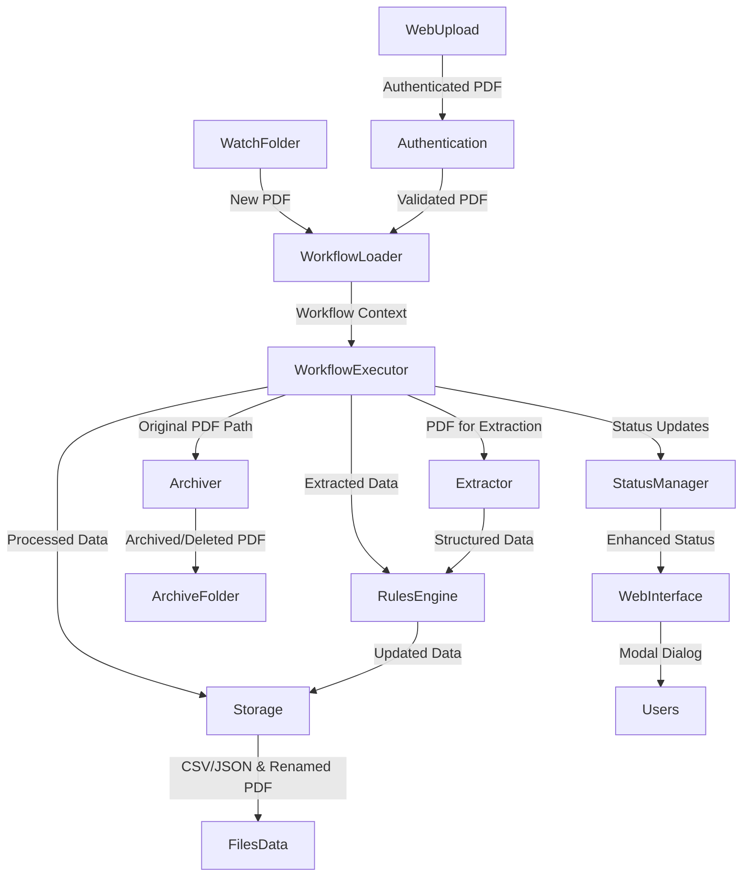

# Design Architecture for PDF Processing System

## Purpose

This document presents the architecture and design rationale for the PDF Processing System. It is written for senior software architects who will take ownership of the codebase, evolve the design, and plan improvements.

## Audience

- Senior software architects
- Engineering managers planning refactor or re-architecture
- Technical leads responsible for operations and SRE

## Context and source pointers

- User guide: [`docs/user_guide.md`](docs/user_guide.md:1)
- Key implementation files:
- Standard Steps: [`standard_step/`](standard_step/:1) (contains various task implementations like extraction, rules, storage, context, housekeeping)
- [`standard_step/rules/update_reference.py`](standard_step/rules/update_reference.py:1)
- [`standard_step/extraction/extract_pdf.py`](standard_step/extraction/extract_pdf.py:1)
- [`standard_step/context/assign_nanoid.py`](standard_step/context/assign_nanoid.py:1)
- [`standard_step/housekeeping/cleanup_task.py`](standard_step/housekeeping/cleanup_task.py:1)
- Core modules: [`modules/base_task.py`](modules/base_task.py:1), [`modules/config_manager.py`](modules/config_manager.py:1), [`modules/status_manager.py`](modules/status_manager.py:1), [`modules/workflow_loader.py`](modules/workflow_loader.py:1), [`modules/workflow_manager.py`](modules/workflow_manager.py:1)
- [`modules/watch_folder_monitor.py`](modules/watch_folder_monitor.py:1), [`modules/auth_utils.py`](modules/auth_utils.py:1), [`modules/api_router.py`](modules/api_router.py:1)
- [`modules/workflow_loader.py`](modules/workflow_loader.py:1)
- [`modules/config_manager.py`](modules/config_manager.py:1)
- [`modules/status_manager.py`](modules/status_manager.py:1)
- [`standard_step/archiver/archive_pdf.py`](standard_step/archiver/archive_pdf.py:1)
- Web interface: [`web/server.py`](web/server.py:1), [`web/templates/dashboard.html`](web/templates/dashboard.html:1), [`web/static/js/status.js`](web/static/js/status.js:1)
These files are the primary implementations referenced by this architecture document.

## High-level goals

- Reliable, auditable processing of PDFs through configurable pipelines
- Clear separation of concerns: ingestion, extraction, rules, storage, archiver, housekeeping
- Minimal blast radius for failures; predictable restart behavior
- Ease of extension: add new standard steps or external providers with minimal changes

## System overview

The system is organized around pipelines defined in configuration (YAML). For each input PDF the system:
- ingests the file via watch folder or web upload
- runs extraction to produce a structured data payload
- runs rule processors to perform domain logic (for example update reference CSVs)
- persists metadata and files using storage steps
- optionally archives or cleans up inputs

## Logical components

- Watch Folder Monitor: detects new PDFs and moves them to processing dir. This component adheres to the Single Responsibility Principle by focusing solely on file ingestion, decoupling it from the core processing logic.
- Workflow Loader: selects a workflow based on matching rules and supplies tasks. This component is responsible for dynamic task instantiation and managing the sequence of operations, ensuring flexibility in pipeline definition.
- Standard Steps: pluggable tasks under `standard_step` (extraction, rules, storage, archiver, housekeeping). These are designed as independent, reusable units of work.
- Config Manager: validates configuration at startup and enforces folder/file existence. It centralizes system configuration and ensures operational readiness.
- Status Manager: records task lifecycle events for operational visibility. This provides a standardized mechanism for reporting progress and errors across the pipeline.

## Data flow



## Component responsibilities and APIs

- WatchFolder
  - Responsibilities: detect files, validate PDF header, move to processing dir with UUID. This involves interaction with the underlying OS file system APIs for monitoring and file operations.
  - Configuration: `watch_folder.dir`, `watch_folder.processing_dir` (see [`docs/user_guide.md`](docs/user_guide.md:1))

- WorkflowLoader
  - Responsibilities: load `config.yaml`, match workflows to file metadata, instantiate tasks from `tasks` registry. It dynamically creates task instances based on configuration, allowing for flexible pipeline definitions without code changes. It also directly instantiates and appends the `CleanupTask` from `standard_step/housekeeping/cleanup_task` as a mandatory final step in every Prefect flow, ensuring it runs last regardless of pipeline configuration or previous errors.
  - Important contract: tasks are referenced by `module` and `class` and receive `params`. The loader ensures that task dependencies (e.g., data from previous steps) are passed through the `context` dictionary.

- Standard Steps
  - Each standard step implements a task class; tasks extend `modules/base_task.BaseTask`. This base class defines the common interface for all tasks, including methods like `on_start`, `run`, `validate_required_fields`, and `register_error`.
  - Side effects: file I/O, network calls, status updates must be explicit and contained within the task's `run` method, promoting modularity and testability.
  - Example: [`standard_step/rules/update_reference.py`](standard_step/rules/update_reference.py:1) updates CSVs atomically and emits status events via `modules/status_manager.py` (`modules/status_manager.py:1`).

  - Housekeeping Task (`CleanupTask`): Responsibilities include moving processed files from the processing directory to an archive directory while preserving original filenames, cleaning up associated status files, logging all operations and errors, raising exceptions on critical failures (e.g., file move errors), and ensuring execution as the final step regardless of previous task outcomes.

- Enhanced Web Interface and Modal Dialog System
  - **Authentication**: JWT-based single-user authentication with session management via [`modules/auth_utils.py`](modules/auth_utils.py:1)
  - **File Upload**: Web-based PDF upload with progress tracking and header validation
  - **Status Dashboard**: Real-time processing status display with enhanced modal dialog system
  - **Modal Dialog Features**:
    - Complete status data including timestamps, details, and processing history
    - Singapore timezone conversion (GMT+8) for all timestamp displays
    - Timeline visualization with chronological processing steps and color-coded status indicators
    - Reference document match detection and special note section
    - Collapsible raw JSON debug view for technical troubleshooting
    - Responsive CSS grid layout with auto-fit columns
    - Accessibility features including focus management and keyboard navigation
    - Graceful fallback handling with inline styling system
  - **API Endpoints**: RESTful API with enhanced status responses via [`modules/api_router.py`](modules/api_router.py:1)
    - `POST /upload`: PDF file upload with validation and progress tracking
    - `GET /api/files`: Retrieve list of processed files with status information
    - `GET /api/status/{file_id}`: Detailed status with complete processing history, timeline, and debug information
    - Graceful fallback handling for missing status files with appropriate error responses

- Context Management Tasks
  - **Nanoid Generation**: [`standard_step/context/assign_nanoid.py`](standard_step/context/assign_nanoid.py:1) generates secure, unique nanoid strings (5-21 characters)
  - **Configuration validation**: Validates length parameters and ensures proper configuration
  - **Context integration**: Adds generated nanoid to processing context under "nanoid" key for use by subsequent tasks

## Notes on UpdateReferenceTask

- Matches up to 5 equality clauses via config path `csv_match.clauses`
- Writes a single `update_field` with configured `write_value`
- Performs atomic write by writing temp file then os.replace; optionally writes `.backup`
- Does not append new rows; it only updates existing rows based on mask
- Numeric comparisons: supports forced numeric, forced string, or auto-detection
- Current implementation requires `csv_match.type` to be "column_equals_all" (see [`standard_step/rules/update_reference.py`](standard_step/rules/update_reference.py:186))
- Numeric comparison uses an absolute tolerance of 1e-9 when comparing numbers (see [`standard_step/rules/update_reference.py`](standard_step/rules/update_reference.py:289))
- If `update_field` is not present in the CSV the task will create the column before writing (see [`standard_step/rules/update_reference.py`](standard_step/rules/update_reference.py:365))

> **Migration Note:** Update Reference Configuration Update: Bare field names (e.g., 'purchase_order_number') are now preferred over dotted paths (e.g., 'data.purchase_order_number'). The dotted format is still supported for backward compatibility but will be deprecated in future releases. Deprecation warnings are logged when the old format is used.

## Configuration and validation

- ConfigManager validates `_dir` existence and `_file` presence at startup
- `config.yaml` contains `tasks` registry; each task entry must include `module`, `class`, and `params`
- Validation guidance:
  - Keep watch folder path stable and ensure permissions are set
  - Avoid using relative paths that may vary between environments

## Concurrency and process model

The current implementation runs single-process and executes workflows sequentially per file. This behavior is primarily driven by the main application loop in [`main.py`](main.py:205), which orchestrates file processing via [`modules/file_processor.py`](modules/file_processor.py:1), [`modules/workflow_manager.py`](modules/workflow_manager.py:1), and [`modules/watch_folder_monitor.py`](modules/watch_folder_monitor.py:1). The housekeeping task, invoked unconditionally by the WorkflowLoader, ensures final cleanup and status updates even if prior tasks fail, aligning with the error handling strategy.

Where to change: To introduce concurrency or worker pools, the starting points for modification would be [`main.py`](main.py:205), [`modules/file_processor.py`](modules/file_processor.py:1), [`modules/workflow_manager.py`](modules/workflow_manager.py:1), and [`modules/watch_folder_monitor.py`](modules/watch_folder_monitor.py:1). Consider integrating queue options like Redis or Celery to manage task distribution.

## Error handling and retries

The codebase implements a Railway Programming pattern: tasks report failures into the shared workflow context and surface critical failures via a `TaskError` exception. The canonical helpers live in the base task contract and exception definitions — see [`modules/base_task.py`](modules/base_task.py:103) and [`modules/exceptions.py`](modules/exceptions.py:1). Concrete task handling of failures can be seen in implementations such as [`standard_step/rules/update_reference.py`](standard_step/rules/update_reference.py:405).

Example (documentation-only snippet):

```py
# Pseudo-example: record an error then raise TaskError so callers can decide to stop/continue
from modules.exceptions import TaskError

if some_precondition_is_missing:
    self.register_error(context, TaskError("Missing required parameter"))
    raise TaskError("Missing required parameter")
```

Tasks should also update the `StatusManager` on failure to provide operational visibility (see failure handling in [`standard_step/rules/update_reference.py`](standard_step/rules/update_reference.py:409)).

- `on_error` per task controls pipeline continuation (`stop` or `continue`), allowing granular control over error handling behavior.
- Recommendations:
  - Standardize transient vs permanent error classification to inform retry strategies.
  - Add retry policy configuration for network-bound tasks with exponential backoff and jitter to handle transient external service issues gracefully.

## Observability and logging

- Ensure structured logs (JSON or key=value) for easier ingestion into log aggregators. The current logging configuration is defined in `config.yaml` under the `logging` section (e.g., `log_file`, `log_level`).
- Emit metrics:
  - `processing_time` per file
  - `task_success_rate` and `task_failure_rate`
  - `queue_depth` if using a job queue
- Integrate with tracing (OpenTelemetry) to follow work across components and provide end-to-end visibility into workflow execution.

## Data contracts and schema evolution

- Extraction producers must document field keys and types in `config.yaml` under `fields`
- Use a schema registry or central JSON schema files under `schema/` to validate extracted payloads
- Backwards compatibility:
  - Storage templates and rename patterns should tolerate missing optional fields

## v2 LlamaExtract Array-of-Objects Support

### Overview

The v2 extraction and storage system extends the original implementation to handle LlamaExtract responses containing arrays of objects (e.g., invoice line items). This feature allows extraction of structured data where certain fields return lists of sub-objects, such as Items: [{Description, Quantity}, ...].

### Schema Handling

- **Array Field Discovery**: The extraction configuration marks fields as tables using `is_table: true` in the field definition. The normalized field name is used as the context key.
- **Normalization**: Array-of-objects are flattened into List[Any] with cleaned string values under `context["data"][normalized_field_name]`.
- **Example LlamaExtract Response**:
  ```json
  {
    "data": {
      "Supplier name": "ALLIGATOR SINGAPORE PTE LTD",
      "Items": [
        {"Description": "ELECTRODE G-300 3.2MM 5KG", "Quantity": "4.0 PKT"},
        {"Description": "QUICK COUPLER SOCKET", "Quantity": "2.0 PCS"}
      ]
    }
  }
  ```
- **Normalized Context**:
  ```python
  {
    "data": {
      "supplier_name": "ALLIGATOR SINGAPORE PTE LTD",
      "items": [  # normalized field name from LlamaCloud schema
        {"description": "ELECTRODE G-300 3.2MM 5KG", "quantity": "4.0 PKT"},
        {"description": "QUICK COUPLER SOCKET", "quantity": "2.0 PCS"}
      ]
    }
  }
  ```

### Storage Semantics

#### JSON Storage (v2)
- Preserves the list-of-dicts under the normalized field name (e.g., 'items').
- Top-level fields are mapped to their configured aliases.
- Maintains backward compatibility with scalar-only data.

#### CSV Storage (v2)
- **Row-per-item mode**: Emits N rows for N line items, repeating scalar fields in each row.
- **Column naming**: Item-level columns use the alias prefixed with 'item_' (e.g., 'item_description', 'item_quantity').
- **Fallback behavior**: If no table field is configured or the list is empty, falls back to v1 single-row format with scalar fields.
- **Field classification**: Scalar (non-array) fields are repeated in each CSV row. Array fields marked with `is_table: true` are expanded into separate columns.

### Configuration Example

Add to extraction.fields in config.yaml:
```yaml
items:  # Field name from LlamaCloud schema (normalized)
  alias: "Items"  # Matches LlamaCloud response
  type: "List[Any]"  # Currently supported type
  is_table: true  # Marks this field as an array of objects
  item_fields:  # Optional: mapping for sub-fields within each item
    Description:
      alias: "description"  # Used as-is in context and as CSV column name
      type: "str"
    Quantity:
      alias: "quantity"     # Used as-is in context and as CSV column name
      type: "str"
```

### Current Limitations

- **Single Table Support**: Only one `is_table: true` field is supported per extraction. Multiple array fields cannot be flattened simultaneously.
- **Flat Structure Assumption**: Items must be simple dictionaries. Nested arrays or objects within items require additional expansion logic.
- **Type System Constraints**: Relies on the existing type parser. Complex nested types may require extension of the parser.

### Migration Path

- v2 modules are created as parallel implementations (e.g., `extract_pdf_v2.py`, `store_metadata_as_json_v2.py`).
- Configuration-driven: Enable v2 by updating module paths in `config.yaml` and adding `is_table: true` to relevant fields.
- Backward compatibility: v1 tasks remain available and functional for existing configurations.

## Authentication and session management

- **JWT-based authentication**: Single-user authentication system using JSON Web Tokens
- **Password security**: Bcrypt password hashing with configurable salt rounds via [`tools/generate_password_hash.py`](tools/generate_password_hash.py:1)
- **Session management**: Automatic session expiry with configurable timeout periods
- **Security features**:
  - Secure password storage in configuration files
  - Token-based API authentication for all protected endpoints
  - Automatic logout on session expiry
  - Protection against common web authentication vulnerabilities

## Security considerations

- Secret management: move API keys out of `config.yaml` into a secrets manager (Vault, AWS Secrets Manager)
- File permissions: ensure processing directories are restricted to service account
- Input validation: validate PDFs (e.g., header, basic structure) and sanitize all extracted data before writing to CSV/JSON or using in filename templates to prevent data corruption or injection.
- Secure coding practices: adhere to principles like least privilege, defense-in-depth, and avoiding common vulnerabilities (e.g., SQL injection, command injection, insecure deserialization).
- Limit potential command injection from user-provided filename patterns by strict templating and whitelisting allowed characters/patterns.

## Testing strategy

- Unit tests:
  - Core components: [`test/core/test_config_manager.py`](test/core/test_config_manager.py:1), [`test/core/test_file_processor.py`](test/core/test_file_processor.py:1), [`test/core/test_status_manager.py`](test/core/test_status_manager.py:1)
  - Standard steps: [`test/standard_step/rules/test_update_reference.py`](test/standard_step/rules/test_update_reference.py:1), [`test/standard_step/housekeeping/test_cleanup_task.py`](test/standard_step/housekeeping/test_cleanup_task.py:1), [`test/standard_step/test_archiver.py`](test/standard_step/test_archiver.py:1)
  - Workflow components: [`test/workflow/test_workflow_loader.py`](test/workflow/test_workflow_loader.py:1), [`test/workflow/test_workflow_manager.py`](test/workflow/test_workflow_manager.py:1)
  - Extraction logic: [`test/extraction/test_extraction.py`](test/extraction/test_extraction.py:1)
  - Storage operations: [`test/storage/test_storage.py`](test/storage/test_storage.py:1)
  - Authentication: [`test/core/test_auth_utils.py`](test/core/test_auth_utils.py:1)
  - Utilities: [`test/utils/test_utilities.py`](test/utils/test_utilities.py:1)
  - Third-party integrations: [`test/third_party/llamacloud_connection_test.py`](test/third_party/llamacloud_connection_test.py:1)
- Integration tests:
  - End-to-end pipeline test using sample PDFs and a temporary filesystem (pytest fixtures)
  - API endpoint testing: [`test/integration/test_api_endpoints.py`](test/integration/test_api_endpoints.py:1)
  - Input processing workflows: [`test/integration/test_input_processing.py`](test/integration/test_input_processing.py:1)
- Test utilities:
  - Password hash generation: [`tools/generate_password_hash.py`](tools/generate_password_hash.py:1)
  - Mocking and test data management utilities
- Load tests:
  - Simulate high file ingestion rates to validate queue and worker scaling

## Deployment and operations

- Packaging:
  - Provide a Dockerfile for containerized deployments; ensure runtime user and file permissions are set
- Runtime:
  - Run as service with process supervisor (systemd or container orchestration)
- Configuration rollout:
  - Use config versioning and staged rollout; validate `config.yaml` in CI

## Recommended refactor opportunities for future improvements

- Modularize task registration:
  - Provide a plugin interface for third-party steps and versioned task contracts
- Replace synchronous file replacement with content-addressable versioning or object storage for large scale
- Introduce explicit schema validation for CSV reference files and extraction outputs
- Add comprehensive feature flags around new matching behaviors (fuzzy match, substring, regex)

## Operational runbook (summary)

- Startup validation errors: check missing folders or files reported by ConfigManager
- If files stuck in processing_dir: inspect status `.txt` files and application logs
- Recovery steps:
  - Re-run failed pipeline for a file by moving input back to watch folder or invoking a CLI helper

## Appendix

- Useful files:
  - User guide: [`docs/user_guide.md`](docs/user_guide.md:1)
  - Reference task: [`standard_step/rules/update_reference.py`](standard_step/rules/update_reference.py:1)
  - Tests:
    - Core tests: [`test/core/test_config_manager.py`](test/core/test_config_manager.py:1), [`test/core/test_file_processor.py`](test/core/test_file_processor.py:1)
    - Workflow tests: [`test/workflow/test_workflow_loader.py`](test/workflow/test_workflow_loader.py:1)
    - Integration tests: [`test/integration/test_api_endpoints.py`](test/integration/test_api_endpoints.py:1)
    - Standard step tests: [`test/standard_step/rules/test_update_reference.py`](test/standard_step/rules/test_update_reference.py:1)
- Recommended next steps for a takeover:
  - Run full test suite and add missing unit tests for edge cases
  - Add CI linting, type checking (mypy), and pre-commit hooks

End of document.