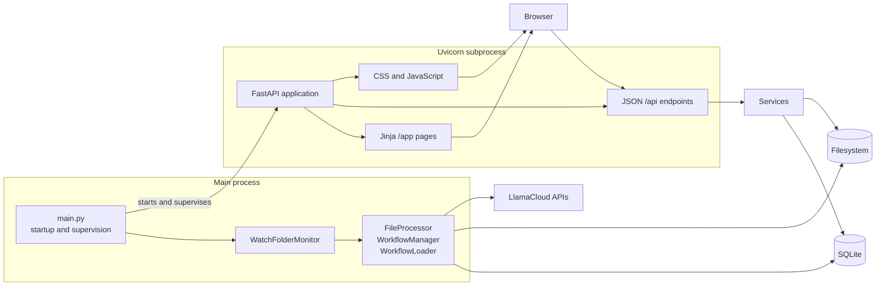
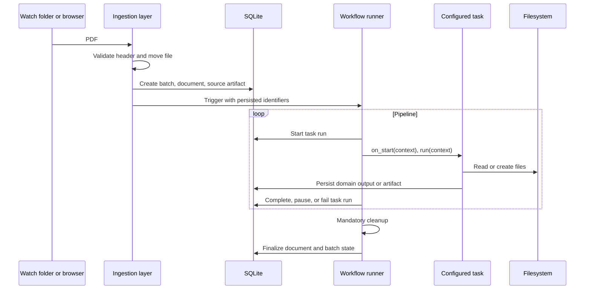
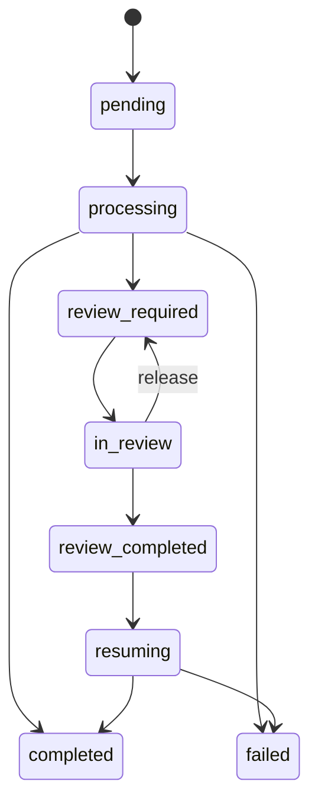
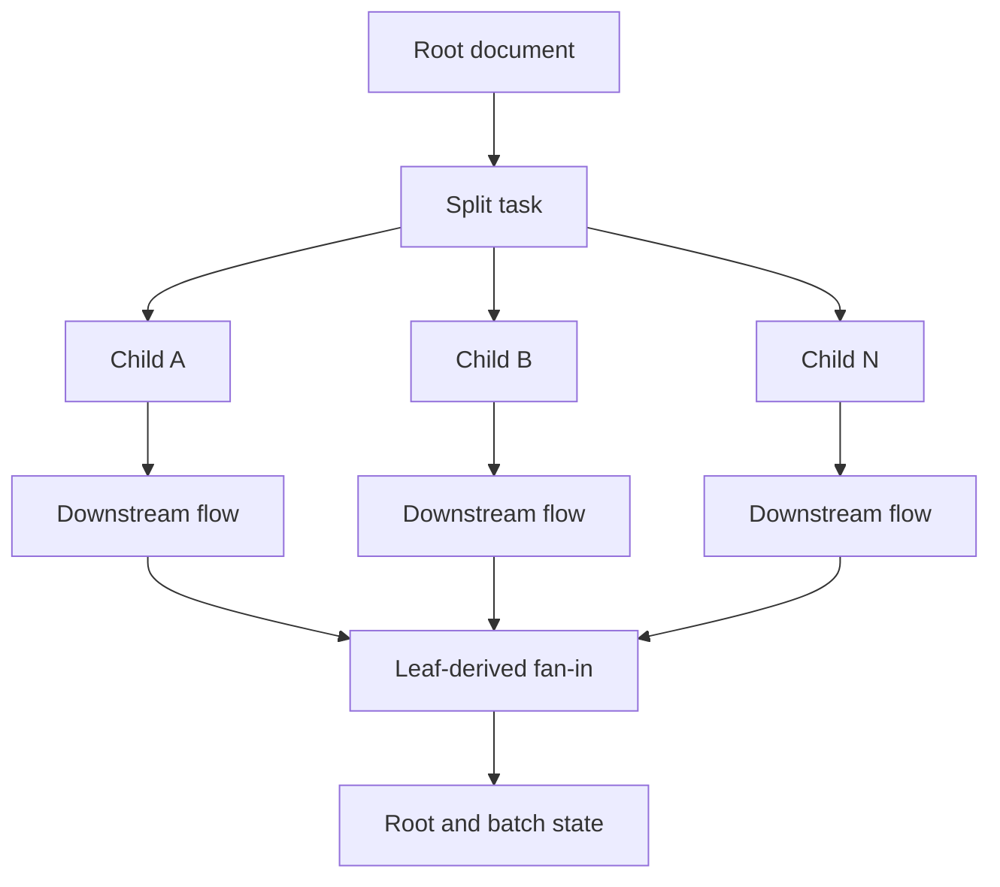
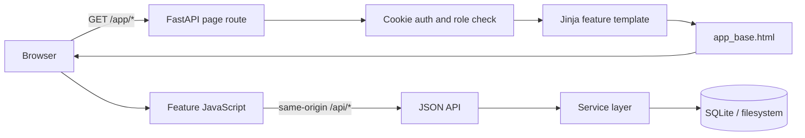

# PDF Processing System Architecture

## Document status

| Item | Value |
| --- | --- |
| Purpose | Technical orientation and architectural boundary reference |
| Audience | Senior engineers, architects, technical leads, and operational owners |
| Scope | Production application under `main.py`, `modules/`, `standard_step/`, and `web/` |
| Excluded | User procedures, provider-specific field configuration, and the visual-editor prototype |
| Last verified | 2026-06-24 |
| Verified revision | `67c76a9` |

This document describes the current implementation, not a target-state
architecture.

## Architecture at a glance

The application processes PDFs through a YAML-configured sequence of Python
tasks. Files enter through a polling watch folder or authenticated web upload.
The application creates SQLite batch and document records, executes the
configured workflow, persists extraction and review state, registers durable
file artifacts, and exposes operational workflows through FastAPI.

The essential model is:

- SQLite is authoritative for operational workflow state.
- The filesystem stores PDFs, exports, schemas, configuration, and other large
  artifacts.
- Prefect wraps task execution and retries; it is not the authoritative
  workflow-state store.
- Human review is an application-level pause. Resume reconstructs context from
  SQLite and starts a new flow at the next task.
- Split processing creates child documents with independent downstream
  workflows and leaf-derived fan-in.
- The production frontend is a server-rendered FastAPI/Jinja multi-page
  application enhanced by page-specific vanilla JavaScript.
- Dynamic task imports are allow-listed.
- `StatusManager`, text status files, `/api/files`, and
  `/api/status/{file_id}` are compatibility-only surfaces.

## Key architectural decisions

1. **SQLite owns operational state.** New workflow-state features use
   repositories and services rather than status files.
2. **The filesystem owns large artifacts.** SQLite records artifact role,
   path, and metadata rather than file contents.
3. **Pipeline composition is configuration-driven.** YAML defines task order,
   implementation, parameters, and error behavior.
4. **Workflow control is application-managed.** SQLite and workflow context
   drive progress, pause, resume, failure, and split behavior.
5. **Backend responsibilities are layered.** Routes handle HTTP concerns,
   services handle use cases, and repositories handle table-specific storage.
6. **Production and prototype UI are separate.** Production behavior belongs
   under `web/`; `pipeline_visual_editor_prototype/` is not loaded at runtime.

## Runtime topology


```mermaid
flowchart LR
    subgraph Parent["Main process"]
        Main["main.py<br/>startup and supervision"]
        Watch["WatchFolderMonitor"]
        Runner["FileProcessor<br/>WorkflowManager<br/>WorkflowLoader"]
        Main --> Watch --> Runner
    end

    subgraph Web["Uvicorn subprocess"]
        App["FastAPI application"]
        Pages["Jinja /app pages"]
        APIs["JSON /api endpoints"]
        Assets["CSS and JavaScript"]
        App --> Pages
        App --> APIs
        App --> Assets
    end

    Main -->|starts and supervises| App
    Runner --> DB[(SQLite)]
    APIs --> Services["Services"] --> DB
    Runner --> Files[(Filesystem)]
    Services --> Files
    Runner --> Provider["LlamaCloud APIs"]
    Pages --> Browser["Browser"]
    Assets --> Browser
    Browser --> APIs
```

The default deployment contains two local processes:

1. `main.py` resolves configuration, runs migrations, validates the task
   registry, configures logging, and constructs ingestion/workflow components.
2. Unless `--no-web` is supplied, it starts Uvicorn as a subprocess.
3. The parent process runs the polling watch-folder monitor and supervises the
   web subprocess.
4. Both processes access the configured SQLite database and filesystem.

Watch-folder files are processed sequentially. Web batch uploads use FastAPI
background tasks and can overlap with watch-folder or other web work. Split
children are launched sequentially. There is no distributed queue, worker
pool, or multi-host coordination layer.

## Component boundaries

| Component | Responsibility | Boundary |
| --- | --- | --- |
| [`main.py`](../main.py) | Startup, supervision, shutdown | No workflow business logic |
| [`WatchFolderMonitor`](../modules/watch_folder_monitor.py) | Poll, validate, and move PDFs | No durable workflow-state ownership |
| [`FileProcessor`](../modules/file_processor.py) | Place files, create ingestion state, trigger processing | No task policy |
| [`WorkflowManager`](../modules/workflow_manager.py) | Start root, child, and resumed flows | No table-specific persistence |
| [`WorkflowLoader`](../modules/workflow_loader.py) | Approve, instantiate, and execute configured tasks | No domain task behavior |
| [`BaseTask`](../modules/base_task.py), `standard_step/` | One configured operation | Preserve context and failure contracts |
| [`modules/services/`](../modules/services/) | Use cases and cross-table invariants | No HTTP request concerns |
| [`modules/db/repositories.py`](../modules/db/repositories.py) | Table-specific persistence | No cross-domain orchestration |
| [`modules/api_router.py`](../modules/api_router.py) | JSON API composition | New business logic belongs in services |
| [`web/server.py`](../web/server.py) | App construction and authenticated page routes | No workflow-state ownership |
| [`web/templates/`](../web/templates/) | Server-rendered structure | No authorization enforcement |
| [`web/static/js/`](../web/static/js/) | Browser interaction and API consumption | No authoritative business state |

`modules/api_router.py` remains a large integration point. The intended
route/service/repository boundary is therefore both a design rule and current
technical debt.

## Ingestion and workflow execution


```mermaid
sequenceDiagram
    participant Source as Watch folder or browser
    participant Ingest as Ingestion layer
    participant DB as SQLite
    participant Runner as Workflow runner
    participant Task as Configured task
    participant FS as Filesystem

    Source->>Ingest: PDF
    Ingest->>Ingest: Validate header and move file
    Ingest->>DB: Create batch, document, source artifact
    Ingest->>Runner: Trigger with persisted identifiers
    loop Pipeline
        Runner->>DB: Start task run
        Runner->>Task: on_start(context), run(context)
        Task->>FS: Read or create files
        Task->>DB: Persist domain output or artifact
        Runner->>DB: Complete, pause, or fail task run
    end
    Runner->>Runner: Mandatory cleanup
    Runner->>DB: Finalize document and batch state
```

### Ingestion paths

- **Watch folder:** validates the `%PDF-` signature, assigns a UUID, moves the
  file to the processing directory, creates a batch/document, and invokes the
  workflow synchronously.
- **Primary web upload:** `POST /api/batches/upload` creates one batch with a
  document per accepted PDF, records source artifacts, and schedules
  background processing.
- **Legacy web upload:** older single-file routes and response shapes remain
  for compatibility. New browser flows should use the batch API.

### Pipeline construction

The YAML `pipeline` list defines order. Each entry in `tasks` supplies:

```yaml
tasks:
  example_task:
    module: standard_step.example
    class: ExampleTask
    params: {}
    on_error: stop

pipeline:
  - example_task
```

For each task, `WorkflowLoader` verifies module/class approval, places the
configured pipeline key and index in `current_task_key` and
`current_task_index`, starts a SQLite task run when document state is
available, instantiates the task with the resolved `params`, invokes it
through a Prefect task wrapper, and persists the result. The pipeline key is
the authoritative operational identity even when SQLite state is unavailable.
`on_error` is `stop` or `continue`.

Configured tasks and cleanup currently receive one Prefect retry. Individual
provider tasks can add their own retries, so retry policy is not centralized.
After configured execution exhausts the pipeline or stops on an ordinary
failure, cleanup runs as an internally managed task with the reserved key
`cleanup_task` and index immediately after the configured pipeline. It has its
own SQLite task run but does not move the document's configured pipeline
cursor. Review pause and split fan-out return before cleanup; resumed and split
child flows run cleanup when their configured work finishes.

### Task and context contract

Standard tasks inherit from `BaseTask` and implement `on_start`, `run`, and
`validate_required_fields`. Expected failures use `TaskError` and
`register_error`. New tasks must not write workflow status through
`StatusManager` or text files. Tasks use their injected parameters and must not
reload their own parameters from a fixed `tasks.<name>` configuration path,
because one implementation may be configured under different pipeline keys.

The mutable context is the internal task protocol:

| Category | Representative keys |
| --- | --- |
| Identity | `id`, `batch_id`, `document_id` |
| Input | `file_path`, `original_filename`, `source` |
| Position | `current_task_index`, `current_task_key`, `task_run_id` |
| Output | `data`, `metadata` |
| Failure | `error`, `error_step`, `fatal_failure` |
| Review | `review_required`, `review_item_id`, `pipeline_state` |
| Split | `parent_document_id`, `split_children`, `fan_out_start_task_index` |

The context is extensible but weakly typed. State required for resume,
operator visibility, or audit must also be persisted in SQLite. Detailed task
rules are in the
[standard task creation guidelines](../tasks/standard_task_creation_guidelines.md).

## State model

- A **batch** groups documents from one ingestion.
- A **document** represents a root PDF or split child.
- A **task run** records one configured task execution for one document.
- A **review item** represents operator work created by the review gate.


```mermaid
stateDiagram-v2
    [*] --> pending
    pending --> processing
    processing --> completed
    processing --> failed
    processing --> review_required
    review_required --> in_review
    in_review --> review_required: release
    in_review --> review_completed
    review_completed --> resuming
    resuming --> completed
    resuming --> failed
```

Task runs use `running`, `completed`, `paused`, and `failed`. Context values
such as `pipeline_state: paused` and `pipeline_state: fan_out` are execution
signals, not database entities.

For split processing:

- A root may become `split_completed` after child creation.
- A root or batch remains `processing` while a leaf is non-terminal.
- A review leaf produces aggregate `review_required`.
- Mixed successful and failed leaves produce `completed_with_errors`.
- All failed leaves produce `failed`.

## Human review

Human review is a persisted stop and new-flow restart:

1. Extraction persists normalized results and fields.
2. `ReviewGateTask` evaluates confidence, required-field, split-confidence,
   and configured policy.
3. If required, it creates a review item, marks the document
   `review_required`, and sets `pipeline_state` to `paused`.
4. The loader marks the task run paused and returns before downstream execution
   or cleanup. Cleanup runs after the resumed flow finishes configured work.
5. An operator claims the item, creating a time-limited lock and changing the
   document to `in_review`.
6. Draft corrections, diffs, and completion are handled by `ReviewService`.
7. Completion persists final values, completes the paused task run, and marks
   the document `review_completed`.
8. `ResumeManager` reconstructs context from SQLite, prevents duplicate
   downstream work, and starts a new flow at the next task.

The original Prefect flow is not suspended. SQLite retains the business state
needed for operator work and resume.

Review lock acquisition is enforced atomically in SQLite. The current operator
may renew a lock, an expired lock may be claimed by another operator, and an
active lock cannot be overwritten by a competing claim.

## Split fan-out and fan-in


```mermaid
flowchart TD
    Root["Root document"] --> Split["Split task"]
    Split --> A["Child A"]
    Split --> B["Child B"]
    Split --> N["Child N"]
    A --> FA["Downstream flow"]
    B --> FB["Downstream flow"]
    N --> FN["Downstream flow"]
    FA --> FanIn["Leaf-derived fan-in"]
    FB --> FanIn
    FN --> FanIn
    FanIn --> Aggregate["Root and batch state"]
```

The split task creates child PDFs and document rows, records parent/root
relationships and split metadata, registers `split_pdf` artifacts, and sets
`pipeline_state` to `fan_out`. `WorkflowManager` starts each child after the
split step. It can run extraction preflight validation and record one
source-level failure affecting all children.

Child creation compensates files and queued child rows if a later segment
fails. If compensation cannot remove a partial child, the remaining partial
records are marked failed so the source and batch do not remain non-terminal.

`FanInService` calculates root and batch status from leaf documents. Parent
containers are not double-counted. Paused children keep the aggregate in
review; mixed terminal outcomes produce `completed_with_errors`.

## Persistence and artifacts

| Domain | SQLite tables |
| --- | --- |
| Identity | `users` |
| Processing | `batches`, `documents`, `task_runs` |
| Extraction | `extraction_results`, `extracted_fields` |
| Review | `review_items`, `review_locks` |
| Artifacts | `document_files` |
| Governance | `audit_events`, `app_settings`, `config_versions` |
| Schema management | `schema_migrations` |

[`modules/db/connection.py`](../modules/db/connection.py) resolves the database
relative to the active configuration, enables row access and foreign keys,
and provides transaction helpers. Repositories own table-specific operations;
services coordinate cross-table behavior.

Migrations currently apply an idempotent schema and record a coarse version.
This is not a complete ordered migration chain with per-change upgrade and
downgrade scripts. When enabled, migrations run during application process
startup; HTTP request dependency resolution does not run schema migrations.
Legacy or direct ingestion helpers may still perform defensive idempotent
initialization before creating workflow state.

SQLite stores artifact identity, role, path, and metadata. The filesystem
stores contents. Canonical roles are:

| Role | Meaning |
| --- | --- |
| `source_original` | Original ingested PDF |
| `split_pdf` | Split child PDF |
| `source_archive` | Archived source copy |
| `export_pdf` | Final PDF output |
| `export_csv` | CSV metadata export |
| `export_json` | JSON metadata export |

Task-created artifact metadata records `task_key` from the workflow context
when producer attribution is needed. Artifact role remains represented by
`file_type`; a separate task slug is not part of the task contract. Ingestion
artifacts such as `source_original` have no producer task key. Split children
and their `split_pdf` artifacts record the configured split task key.

Generated archive, export, and split paths are reserved with exclusive file
creation before content is written. This prevents overlapping local workflows
from selecting and overwriting the same nominally unique output path.

Runtime directories such as `data/`, `files/`, `processing*/`,
`archive_folder/`, `web_upload/`, and `watch_folder/` may contain customer
data and are not source code. Durable task outputs should use
`register_document_artifact`; registered artifacts must survive cleanup.
Registration is currently best-effort, so an unregistered successful file
operation remains a traceability risk. Database exceptions during registration
produce a warning containing only the document identifier, artifact role, and
exception type; the primary file-operation result remains unchanged.

SQLite and local filesystem coupling suit a local or modest-volume
installation. They do not provide a horizontally scaled worker architecture.

## Configuration architecture

Runtime YAML is resolved in this order:

1. `--config-path`
2. `CONFIG_PATH`
3. Repository-root `config.yaml`

| Concern | Current owner |
| --- | --- |
| Pipeline, tasks, paths, web options | Runtime YAML |
| Operational/admin settings | SQLite `app_settings` |
| Draft/published configuration history | SQLite `config_versions` |
| Review form schemas | YAML under configured schema roots |
| Deployment and reload behavior | Environment variables |

`ConfigManager` loads YAML, validates static paths, creates most `_dir`
values, and validates `_dir` and `_file` entries. The watch input directory is
not auto-created. Additional validation covers pipeline order, task
cardinality, review/split parameters, schema containment, and dynamic-import
approval.

The standalone checker provides deeper validation:

```powershell
.\.venv\Scripts\python.exe -m tools.config_check validate `
  --config path\to\config.yaml --import-checks
```

Warning-only results use exit code `2`.

Admin services support configuration draft, validation, diff, and publish.
Runtime behavior still depends on configuration loaded by the process, so
reload semantics matter. Provider secrets must never enter API responses,
audits, summaries, logs, screenshots, tests, commits, or documentation.

## Frontend and UI architecture

### Rendering and data flow


```mermaid
flowchart LR
    Browser["Browser"] -->|GET /app/*| Route["FastAPI page route"]
    Route --> Auth["Cookie auth and role check"]
    Auth --> Template["Jinja feature template"]
    Template --> Shell["app_base.html"]
    Shell --> Browser
    Browser --> Script["Feature JavaScript"]
    Script -->|same-origin /api/*| API["JSON API"]
    API --> Service["Service layer"] --> DB[(SQLite / filesystem)]
```

The production frontend is a server-rendered multi-page application.
[`web/server.py`](../web/server.py) authenticates `/app/*` requests, enforces
admin access, and renders Jinja templates with small identifiers such as a
batch, document, review item, or schema name. Page scripts then fetch most
business data from `/api/*`.

Navigation performs full-page transitions. There is no production client
router, component framework, or central client store. Processing pages poll
for state changes; the processing overview currently refreshes about every
three seconds.

### Frontend layers

| Layer | Location | Responsibility |
| --- | --- | --- |
| Page routes | [`web/server.py`](../web/server.py) | Authentication, roles, template, render context |
| Shared shell | [`app_base.html`](../web/templates/app_base.html) | Navigation, header, slots, shared script |
| Feature templates | [`web/templates/`](../web/templates/) | Semantic structure and server identifiers |
| Shared browser utilities | [`app.js`](../web/static/js/app.js) | API wrappers, CSRF, auth redirect, toasts, navigation |
| Feature controllers | [`web/static/js/`](../web/static/js/) | Fetch, DOM rendering, interactions |
| Styling | Tailwind, DaisyUI, [`app.css`](../web/static/css/app.css) | Design utilities and application styles |

Templates and controllers form implicit DOM/API contracts and must change
together. Authoritative state remains on the server. `localStorage` holds
presentation preferences and short-lived caches; `sessionStorage` holds
limited navigation convenience; neither may represent workflow or permission
state.

Operator pages cover upload, processing, split and extraction inspection,
review, failures, reports, and settings. Admin pages cover users, pipeline,
tasks, schemas, validation, audit, and simulation.

Tailwind scans production templates and JavaScript. Rebuild committed CSS
after utility-class or frontend dependency changes:

```powershell
npm run build:css
```

### Browser security

- JWT access tokens use an HTTP-only cookie.
- Cookie-authenticated mutations require a CSRF cookie and matching
  `X-CSRF-Token` header.
- Page routes and APIs enforce roles server-side; hidden navigation is not an
  authorization control.
- API requests are same-origin by default; CORS requires explicit trusted
  origins.
- Trusted-host, CSP, content-type, referrer, permissions, and frame headers
  are applied globally.
- Normal pages deny framing; same-origin PDF responses may be framed by the
  review workspace.

### Frontend constraints

- Complex pages use large vanilla-JavaScript controllers.
- API and DOM contracts are not typed or generated.
- Shared forms, tables, modals, loading, and errors are only partly
  centralized.
- Polling replaces server-pushed updates.
- Production JavaScript has no bundling or static type-checking stage.
- Demoted review-gate and split-settings templates/scripts remain although
  their routes redirect to the pipeline page.

The React/Vite visual editor has separate dependencies and is not production
behavior until deliberately ported into `web/`.

## API, authentication, and trust boundaries

`modules/api_router.build_router()` composes APIs for authentication, uploads,
batches, documents, extraction, review, split results, failures, reports,
settings, schemas, pipeline administration, users, audit, and legacy
compatibility.

Endpoints should validate requests, enforce authorization, call services, and
construct responses. Cross-table invariants belong in services. A router-wide
dependency protects cookie-authenticated mutations with CSRF checks;
Bearer-token callers are exempt from the cookie-specific check.

The current identity model has fixed `admin` and `operator` accounts. SQLite
stores role, bcrypt password hash, token version, and password timestamps.
JWT validation compares subject, role, and token version with the current user
row, so password changes can revoke sessions. Login throttling is in-memory
and therefore process-local.

Principal trust boundaries are:

- Uploaded PDFs are untrusted and receive only minimal signature validation.
- Dynamic task imports must match approved registrations.
- Schema paths must remain under configured roots.
- Extracted values are untrusted when rendered or used in filenames/exports.
- Provider credentials and responses require redaction.
- Protected document files must be resolved through authorized APIs.

## Errors, recovery, and observability

Expected task failures use `TaskError`; unexpected exceptions become failed
context and task-run state. `on_error` controls stop/continue behavior. Fatal
failure summaries are redacted before persistence or API exposure.

Current operational evidence consists of logs, task-run timelines, batch and
document state, failure records, review/audit events, and artifact records.
Supported metrics and distributed tracing are not currently emitted.

Recovery paths are limited:

- Completed review resumes from the next task using final persisted values.
- Corrected provider/task failures are normally re-ingested.
- Fan-in is recomputed as child leaves finish.
- Arbitrary interrupted flows are not automatically reconstructed; SQLite
  supports diagnosis but there is no durable worker recovery system.

## Testing and verification

Tests are layered across `test/core/`, `test/db/`, `test/services/`,
`test/workflow/`, `test/standard_step/`, `test/integration/`,
`test/security/`, `test/visual/`, and `test/tools/config_check/`.
Prototype tests are separate under `test/pipeline_visual_editor_prototype/`.

Live LlamaCloud checks are opt-in because they require credentials and external
resources. Browser tests may require Playwright Chromium. Pyright has
configuration but is not pinned in application requirements. Ruff and
pytest-cov are not supported project checks unless added to the toolchain.

## Known architectural debt

| Area | Current constraint |
| --- | --- |
| Workflow contract | Weakly typed mutable context dictionary |
| API composition | Large `api_router.py` integration surface |
| Configuration | YAML, SQLite settings, and versions have different semantics |
| Execution | No durable queue, distributed worker, or multi-host coordination |
| Throughput | Sequential watch-folder and split-child processing |
| Persistence | SQLite write-concurrency ceiling and coarse migrations |
| I/O | Blocking file and provider operations in local processes |
| Review | New-flow resume rather than durable engine suspension |
| Compatibility | Legacy status manager, files, and APIs remain |
| Frontend | Large controllers and implicit DOM/API contracts |
| Secrets | Provider credentials may reside in local runtime YAML |
| Storage | Artifact availability assumes shared local filesystem access |

These are current constraints, not an approved target-state plan.

## Extension rules

- **Pipeline task:** inherit `BaseTask`, preserve context/error behavior,
  register the exact module/class pair, register durable artifacts, and add
  task plus workflow tests.
- **Persistence:** add table-specific operations to repositories and
  cross-table behavior to services; update schema/migrations and tests.
- **API:** keep HTTP concerns in the route and business invariants in services;
  preserve role, CSRF, and document-file protections.
- **Production UI:** add an authenticated `/app/*` route, Jinja template, and
  page controller using shared `window.DocFlow` helpers; rebuild CSS when
  needed.
- **Prototype:** do not implement production behavior only in
  `pipeline_visual_editor_prototype/`.

## Related documentation

- [User guide](user_guide.md)
- [Review schema administration](review_schema_admin_guide.md)
- [Configuration checker troubleshooting](config_check_troubleshooting.md)
- [Configuration checker reference](../tools/config_check/README.md)
- [Standard task creation guidelines](../tasks/standard_task_creation_guidelines.md)
- [Future lightweight pipeline visualization](../tasks/future-lightweight-pipeline-visualization.md)
