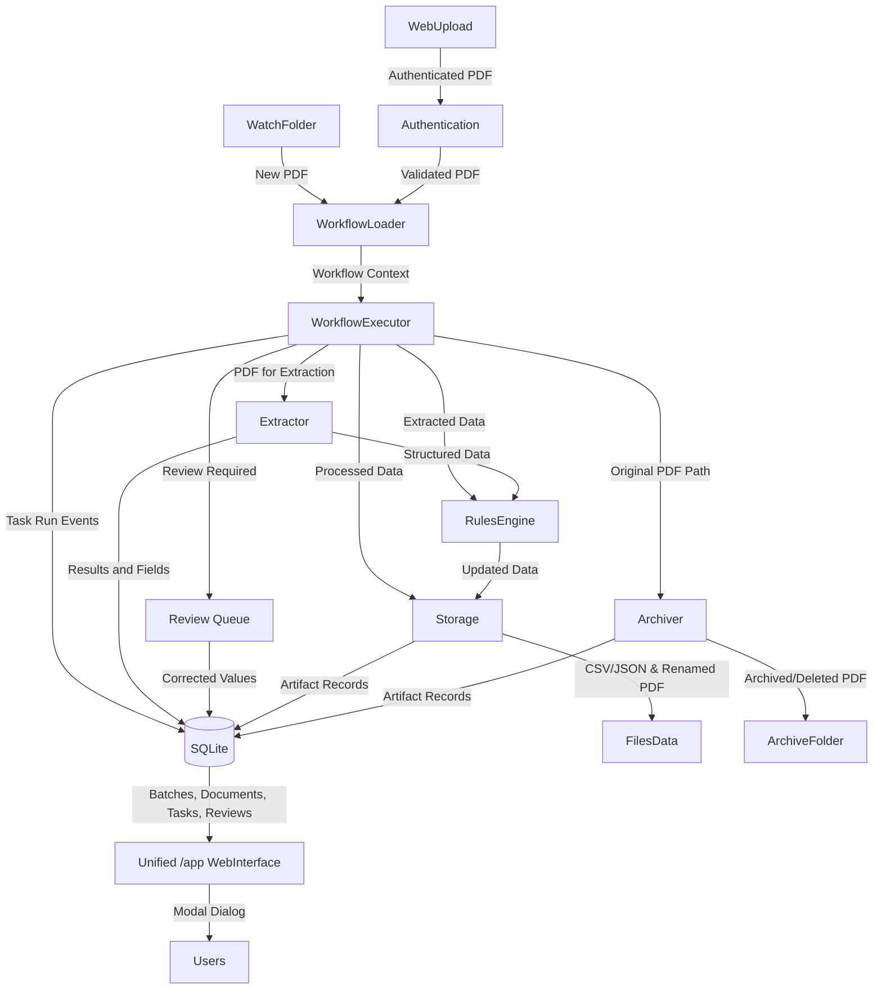

# Design Architecture for PDF Processing System

## Purpose

This document presents the architecture and design rationale for the PDF Processing System. It is written for senior software architects who will take ownership of the codebase, evolve the design, and plan improvements.

## Audience

- Senior software architects
- Engineering managers planning refactor or re-architecture
- Technical leads responsible for operations and SRE

## Context and source pointers

- User guide: [`docs/user_guide.md`](docs/user_guide.md:1)
- Key implementation files:
- Standard Steps: [`standard_step/`](standard_step/:1) (contains various task implementations like extraction, rules, storage, context, housekeeping)
- [`standard_step/rules/update_reference.py`](standard_step/rules/update_reference.py:1)
- [`standard_step/extraction/extract_pdf.py`](standard_step/extraction/extract_pdf.py:1)
- [`standard_step/context/assign_nanoid.py`](standard_step/context/assign_nanoid.py:1)
- [`standard_step/housekeeping/cleanup_task.py`](standard_step/housekeeping/cleanup_task.py:1)
- Core modules: [`modules/base_task.py`](modules/base_task.py:1), [`modules/config_manager.py`](modules/config_manager.py:1), [`modules/workflow_loader.py`](modules/workflow_loader.py:1), [`modules/workflow_manager.py`](modules/workflow_manager.py:1), [`modules/file_processor.py`](modules/file_processor.py:1)
- [`modules/watch_folder_monitor.py`](modules/watch_folder_monitor.py:1), [`modules/auth_utils.py`](modules/auth_utils.py:1), [`modules/api_router.py`](modules/api_router.py:1)
- SQLite data layer: [`modules/db/`](modules/db/:1)
- Application services: [`modules/services/`](modules/services/:1)
- [`standard_step/archiver/archive_pdf.py`](standard_step/archiver/archive_pdf.py:1)
- Web interface: [`web/server.py`](web/server.py:1), [`web/templates/`](web/templates/:1), [`web/static/js/`](web/static/js/:1)
These files are the primary implementations referenced by this architecture document.

## High-level goals

- Reliable, auditable processing of PDFs through configurable pipelines
- Clear separation of concerns: ingestion, extraction, rules, storage, archiver, housekeeping
- Minimal blast radius for failures; predictable restart behavior
- Ease of extension: add new standard steps or external providers with minimal changes

## System overview

The system is organized around pipelines defined in configuration (YAML). For each input PDF the system:
- ingests the file via watch folder or web upload
- creates SQLite batch/document state
- runs extraction to produce a structured data payload
- stores extraction result and field-level confidence/review state
- optionally fans out source PDFs into split child documents
- optionally gates documents into human review
- runs rule processors to perform domain logic (for example update reference CSVs)
- persists metadata and files using storage steps
- optionally archives or cleans up inputs

## Logical components

- Watch Folder Monitor: detects new PDFs and moves them to processing dir. This component adheres to the Single Responsibility Principle by focusing solely on file ingestion, decoupling it from the core processing logic.
- Workflow Loader: builds the Prefect flow from the single configured `pipeline` list and supplies tasks. This component is responsible for dynamic task instantiation and managing the sequence of operations defined in configuration.
- Standard Steps: pluggable tasks under `standard_step` (extraction, rules, storage, archiver, housekeeping). These are designed as independent, reusable units of work.
- Config Manager: validates configuration at startup and enforces folder/file existence. It centralizes system configuration and ensures operational readiness.
- SQLite Repository Layer: owns persistence for batches, documents, task runs, extraction results, review items, document files, settings, and audit history.
- Service Layer: coordinates use cases such as batch upload, review, reports, runtime settings, admin settings, audit events, and artifact registration.
- Unified Web App: `/app/*` pages provide operator and administrator workflows over SQLite-backed APIs.
- Legacy Compatibility: `StatusManager`, `/api/files`, and `/api/status/{file_id}` remain compatibility surfaces. Legacy `/dashboard` and `/upload` HTML pages redirect to the unified `/app/*` interface and are not primary workflow surfaces.

## Data flow


```mermaid
graph TD
    WF[WatchFolder] -->|New PDF| WL[WorkflowLoader]
    WebUpload[WebUpload] -->|Authenticated PDF| Auth[Authentication]
    Auth -->|Validated PDF| WL
    WL -->|Workflow Context| WFProc[WorkflowExecutor]
    WFProc -->|PDF for Extraction| Extract[Extractor]
    WFProc -->|Extracted Data| Rules[RulesEngine]
    WFProc -->|Processed Data| Storage[Storage]
    WFProc -->|Original PDF Path| Archiver[Archiver]
    WFProc -->|Task Run Events| DB[(SQLite)]
    Extract -->|Structured Data| Rules
    Extract -->|Results and Fields| DB
    WFProc -->|Review Required| Review[Review Queue]
    Review -->|Corrected Values| DB
    Rules -->|Updated Data| Storage
    Storage -->|CSV/JSON & Renamed PDF| Output[FilesData]
    Storage -->|Artifact Records| DB
    Archiver -->|Archived/Deleted PDF| ArchiveStore[ArchiveFolder]
    Archiver -->|Artifact Records| DB
    DB -->|Batches, Documents, Tasks, Reviews| WebUI[Unified /app WebInterface]
    WebUI -->|Modal Dialog| Users[Users]
```

## Component responsibilities and APIs

- WatchFolder
  - Responsibilities: detect files, validate PDF header, move to processing dir with UUID. This involves interaction with the underlying OS file system APIs for monitoring and file operations.
  - Configuration: `watch_folder.dir`, `watch_folder.processing_dir` (see [`docs/user_guide.md`](docs/user_guide.md:1))

- WorkflowLoader
  - Responsibilities: load `config.yaml`, instantiate tasks from the configured `pipeline`, and append the housekeeping cleanup step as a final step. It dynamically creates task instances based on configuration, allowing flexible pipeline definitions without code changes.
  - Important contract: tasks are referenced by `module` and `class` and receive `params`. The loader passes a mutable context dictionary through each task. When SQLite context exists, the loader records task-run lifecycle state and output summaries in SQLite.
  - Security boundary: before importing a configured task, the loader verifies the exact module/class pair against the approved task registry. Built-in `standard_step.*` tasks are approved in code; customer tasks require deployment YAML approval under `custom_steps.registry` and must use the `custom_step.` module prefix.

- Standard Steps
  - Each standard step implements a task class; tasks extend `modules/base_task.BaseTask`. This base class defines the common interface for all tasks, including methods like `on_start`, `run`, `validate_required_fields`, and `register_error`.
  - Side effects: file I/O, network calls, context mutations, SQLite persistence, and artifact registration must be explicit and contained within the task's `run` method, promoting modularity and testability.
  - Example: [`standard_step/rules/update_reference.py`](standard_step/rules/update_reference.py:1) updates CSVs atomically and records an operation summary in `context["data"]["update_reference"]`.

  - Housekeeping Task (`CleanupTask`): Responsibilities include cleaning up temporary processing-folder files while preserving registered business artifacts, logging all operations and errors, raising exceptions on critical failures, and ensuring execution as the final step regardless of previous task outcomes.

- SQLite Repositories and Services
  - `modules/db/connection.py` resolves the SQLite path, enables row access, and enforces foreign keys.
  - `modules/db/migrations.py` creates and evolves the application tables.
  - `modules/db/repositories.py` implements persistence boundaries for documents, task runs, extraction results, review items, files, settings, and audit entities.
  - Services under `modules/services/` compose repositories into application use cases. Examples include batch upload, review queue operations, reports summaries, runtime settings, admin settings/versioning, audit event recording, and artifact registration.

- Unified Web Interface
  - **Authentication**: SQLite-backed admin/operator authentication with JWT session management via [`modules/auth_utils.py`](modules/auth_utils.py:1)
  - **Operator UI**: `/app/upload`, `/app/processing`, `/app/batches/{batch_id}`, `/app/batches/{batch_id}/split-results`, `/app/documents/{document_id}/extraction`, `/app/review`, `/app/reports`, and `/app/settings`. Reports expose recent batch records with a modal task-run timeline for each batch.
  - **Admin UI**: `/app/admin`, `/app/admin/users`, `/app/admin/pipeline`, `/app/admin/tasks`, `/app/admin/review-gate`, `/app/admin/split`, `/app/admin/audit`, and `/app/admin/dry-run` (Review Gate Simulator).
  - **Primary APIs**: batch, document, extraction, review, reports, settings, admin settings, pipeline, review-gate, split, schema, and audit endpoints in [`modules/api_router.py`](modules/api_router.py:1).
  - **Legacy APIs**: `/api/files` and `/api/status/{file_id}` return SQLite-backed compatibility responses. New UI code should use the primary SQLite APIs.

- Context Management Tasks
  - **Nanoid Generation**: [`standard_step/context/assign_nanoid.py`](standard_step/context/assign_nanoid.py:1) generates secure, unique nanoid strings (5-21 characters)
  - **Configuration validation**: Validates length parameters and ensures proper configuration
  - **Context integration**: Adds generated nanoid to processing context under "nanoid" key for use by subsequent tasks

## SQLite State Model

SQLite is the authoritative workflow-state store. The design separates operational state from durable business artifacts:

- `batches`: ingestion groups created by batch upload or watch-folder ingestion.
- `documents`: source documents, split child documents, document type/category, and aggregate processing status.
- `task_runs`: task lifecycle records keyed by document and task.
- `extraction_results` and extracted field tables: normalized extraction payloads, provider metadata, confidence, review state, and final values.
- `review_items`: queue, claim, draft, diff, and completion state for human review.
- `document_files`: artifact registry for source originals, split working files, archives, PDF exports, CSV exports, and JSON exports.
- admin/settings/audit tables: versioned settings changes, audit events, and admin workflow history.

The repository layer owns table-specific queries. The service layer owns use-case orchestration and cross-table invariants. Standard steps should not create ad hoc status text files to communicate state.

## Ingestion and Workflow Execution

### Watch Folder Ingestion

The watch folder monitor detects candidate PDFs, validates the `%PDF-` header, and moves the file into the configured processing directory. `FileProcessor` creates SQLite ingestion state when possible, then triggers `WorkflowManager` with `batch_id` and `document_id`.

### Web and Batch Upload

The unified upload page posts to `POST /api/batches/upload`. The API creates one batch with one document per uploaded PDF, persists original source artifacts, and returns a batch route for monitoring.

### Task Execution

`WorkflowManager` and `WorkflowLoader` execute the configured pipeline and create/update SQLite task runs. Each task receives a context dictionary that includes identifiers such as:

- `id`
- `batch_id`
- `document_id`
- `task_run_id`
- `file_path`
- `data`
- `metadata`

Task output summaries are stored for operational visibility. Document status is updated from task-run state and review/split outcomes.

## Review Flow

The review gate evaluates extracted fields and configured review policies. When a review schema is configured, `required: true` fields are treated as mandatory for missing-confidence review gating, while optional schema fields can be displayed and edited without forcing review solely because they have no value or confidence score. Documents can be marked `review_required`, and review items are inserted into the queue. Operators use `/app/review` to claim work, inspect the source PDF and extracted fields, save drafts, compute diffs, and complete review.

Completed review persists corrected field values and review metadata in SQLite. After review, the document can resume downstream workflow steps through `POST /api/documents/{document_id}/resume`.

## Migration from `qa_extracted_data`

The unified application absorbs the useful behavior from the previous `qa_extracted_data` Streamlit application without keeping Streamlit as a runtime dependency.

Replacement mapping:

| Previous capability | Unified implementation |
| --- | --- |
| Streamlit review queue | `/app/review` and `/api/review/items` |
| Streamlit review workspace | `/app/review/{review_item_id}` with SQLite review items and extracted fields |
| Schema loading/editing utilities | `/app/schemas`, `/app/schemas/{schema_name}`, and schema APIs |
| Diff generation | Review diff API and review workspace JavaScript |
| File-locking concepts | Review claim/release semantics with lock timeout |
| Audit logging | Admin/review audit services and SQLite audit tables |
| Separate review data store | SQLite extraction/review tables in the main application |

The architecture keeps schema-driven forms and corrected final values, but the source of truth is now the main app database and app-managed schema/config flows.

Schema files are resolved only under configured schema directories; arbitrary absolute paths are rejected unless they remain within an allowed schema root.

## Split Fan-out and Fan-in

Split processing classifies or separates source PDFs into child documents. The parent/source document records split status and child relationships. Child documents run extraction/review/storage workflows independently. Fan-in aggregates child document state so the source batch can display completion, partial completion, failure, or review-required state.

Split artifacts are stored in `tasks.<split_task>.params.split_dir` as working files or child source artifacts and are associated with their documents in `document_files`.

## Admin Configuration, Audit, and Versioning

Admin UI routes manage runtime settings, pipeline drafts, task catalog views, review-gate rules, split settings, schema validation, and dry runs. Admin changes are versioned where appropriate and recorded through audit services. Audit events should describe:

- who initiated the change
- what setting or configuration was changed
- old/new values or safe summaries
- validation or review-gate simulator results
- timestamps and request context where available

Secrets must not be exposed through runtime settings responses or audit payloads.

## Artifact Registration

Durable files are represented by explicit artifact roles. Current roles include source originals, split working files, source archives, PDF exports, CSV exports, and JSON exports. Storage and archive tasks register generated files with `document_files` when `document_id` is available.

This preserves the boundary between workflow state and business files:

- SQLite answers "what happened, where is it in the workflow, what was reviewed, and what artifacts exist?"
- The filesystem stores large binary/text artifacts such as PDFs, CSVs, JSON exports, reference CSVs, and config/schema files.

## Notes on UpdateReferenceTask

- Matches up to 5 equality clauses via config path `csv_match.clauses`
- Writes a single `update_field` with configured `write_value`
- Performs atomic write by writing temp file then os.replace; optionally writes `.backup`
- Does not append new rows; it only updates existing rows based on mask
- Numeric comparisons: supports forced numeric, forced string, or auto-detection
- Current implementation requires `csv_match.type` to be "column_equals_all" (see [`standard_step/rules/update_reference.py`](standard_step/rules/update_reference.py:186))
- Numeric comparison uses an absolute tolerance of 1e-9 when comparing numbers (see [`standard_step/rules/update_reference.py`](standard_step/rules/update_reference.py:289))
- If `update_field` is not present in the CSV the task will create the column before writing (see [`standard_step/rules/update_reference.py`](standard_step/rules/update_reference.py:365))

> **Migration Note:** Update Reference Configuration Update: Bare field names (e.g., 'purchase_order_number') are now preferred over dotted paths (e.g., 'data.purchase_order_number'). The dotted format is still supported for backward compatibility but will be deprecated in future releases. Deprecation warnings are logged when the old format is used.

## Configuration and validation

- ConfigManager validates `_dir` existence and `_file` presence at startup
- `config.yaml` contains `tasks` registry; each task entry must include `module`, `class`, and `params`
- `database.path` controls SQLite state storage; migrations run on startup when configured
- Task output directories are owned by task parameters such as `data_dir`, `files_dir`, `archive_dir`, `processing_dir`, and split task `split_dir`; `_dir` paths are auto-created at startup except `watch_folder.dir`
- `review` controls review queue defaults and lock behavior
- Admin configuration flows validate pipeline, review-gate, split, and schema settings before publishing changes
- Validation guidance:
  - Keep watch folder path stable and ensure permissions are set
  - Avoid using relative paths that may vary between environments

## Concurrency and process model

The current implementation runs single-process and executes workflows sequentially per file. This behavior is primarily driven by the main application loop in [`main.py`](main.py:205), which orchestrates file processing via [`modules/file_processor.py`](modules/file_processor.py:1), [`modules/workflow_manager.py`](modules/workflow_manager.py:1), and [`modules/watch_folder_monitor.py`](modules/watch_folder_monitor.py:1). The housekeeping task, invoked unconditionally by the WorkflowLoader, ensures final cleanup and task-run state updates even if prior tasks fail, aligning with the error handling strategy.

Where to change: To introduce concurrency or worker pools, the starting points for modification would be [`main.py`](main.py:205), [`modules/file_processor.py`](modules/file_processor.py:1), [`modules/workflow_manager.py`](modules/workflow_manager.py:1), and [`modules/watch_folder_monitor.py`](modules/watch_folder_monitor.py:1). Consider integrating queue options like Redis or Celery to manage task distribution.

## Error handling and retries

The codebase implements a Railway Programming pattern: tasks report failures into the shared workflow context and surface critical failures via a `TaskError` exception. The canonical helpers live in the base task contract and exception definitions — see [`modules/base_task.py`](modules/base_task.py:103) and [`modules/exceptions.py`](modules/exceptions.py:1). Concrete task handling of failures can be seen in implementations such as [`standard_step/rules/update_reference.py`](standard_step/rules/update_reference.py:405).

Example (documentation-only snippet):

```py
# Pseudo-example: record an error then raise TaskError so callers can decide to stop/continue
from modules.exceptions import TaskError

if some_precondition_is_missing:
    self.register_error(context, TaskError("Missing required parameter"))
    raise TaskError("Missing required parameter")
```

Task-run failures are persisted by the workflow loader/manager when document context is available. Tasks should register context errors with `BaseTask.register_error`; durable task outputs should be returned through context and, when they produce files, registered through the artifact service.

- `on_error` per task controls pipeline continuation (`stop` or `continue`), allowing granular control over error handling behavior.
- Recommendations:
  - Standardize transient vs permanent error classification to inform retry strategies.
  - Add retry policy configuration for network-bound tasks with exponential backoff and jitter to handle transient external service issues gracefully.

## Observability and logging

- Ensure structured logs (JSON or key=value) for easier ingestion into log aggregators. The current logging configuration is defined in `config.yaml` under the `logging` section (e.g., `log_file`, `log_level`).
- Emit metrics:
  - `processing_time` per file
  - `task_success_rate` and `task_failure_rate`
  - `queue_depth` if using a job queue
- Integrate with tracing (OpenTelemetry) to follow work across components and provide end-to-end visibility into workflow execution.

## Data contracts and schema evolution

- Extraction producers must document field keys and types in `config.yaml` under `fields`
- Use a schema registry or central JSON schema files under `schema/` to validate extracted payloads
- Backwards compatibility:
  - Storage templates and rename patterns should tolerate missing optional fields

## LlamaCloud Extract v2 Array-of-Objects Support

### Overview

The extraction and storage system uses LlamaCloud Extract v2 through the `llama-cloud` SDK. It handles responses containing arrays of objects (e.g., invoice line items), where certain fields return lists of sub-objects such as Items: [{Description, Quantity}, ...].

The extraction task can either reference a saved LlamaCloud Extract v2 `configuration_id` or build an inline schema from `tasks.<name>.params.fields`. In inline mode, workflow field keys such as `supplier_name` become JSON-schema property names sent to LlamaCloud; aliases remain output labels for storage and reporting.

Saved LlamaCloud configurations may return either workflow field keys or aliases. Extraction normalizes both forms back to workflow field keys in `context["data"]`.

### Schema Handling

- **Array Field Discovery**: The extraction configuration marks fields as tables using `is_table: true` in the field definition. The workflow field key is used as the context key.
- **Normalization**: Array-of-objects are cleaned and stored as `List[Any]` under `context["data"][workflow_field_key]`.
- **Example LlamaCloud Extract v2 Response**:
  ```json
  {
    "data": {
      "Supplier name": "ALLIGATOR SINGAPORE PTE LTD",
      "Items": [
        {"Description": "ELECTRODE G-300 3.2MM 5KG", "Quantity": "4.0 PKT"},
        {"Description": "QUICK COUPLER SOCKET", "Quantity": "2.0 PCS"}
      ]
    }
  }
  ```
- **Normalized Context**:
  ```python
  {
    "data": {
      "supplier_name": "ALLIGATOR SINGAPORE PTE LTD",
      "items": [  # workflow field key from extraction.fields
        {"description": "ELECTRODE G-300 3.2MM 5KG", "quantity": "4.0 PKT"},
        {"description": "QUICK COUPLER SOCKET", "quantity": "2.0 PCS"}
      ]
    }
  }
  ```

### Storage Semantics

#### JSON Storage (v2)
- Preserves list-of-dicts structure for table fields.
- Writes configured fields under their aliases when aliases are present; otherwise it preserves workflow field keys.
- Maintains backward compatibility with scalar-only data.

#### CSV Storage (v2)
- **Row-per-item mode**: Emits N rows for N line items, repeating scalar fields in each row.
- **Column naming**: Scalar and item-level CSV headers use configured aliases. Item-level columns are prefixed with `item_` (e.g., `item_description`, `item_quantity`).
- **Fallback behavior**: If no table field is configured or the list is empty, falls back to v1 single-row format with scalar fields.
- **Field classification**: Scalar (non-array) fields are repeated in each CSV row. Array fields marked with `is_table: true` are expanded into separate columns.

### Configuration Example

Add to extraction.fields in config.yaml:
```yaml
api_key: "llx-REDACTED"
configuration_id: "YOUR-EXTRACT-V2-CONFIGURATION-ID"  # optional
tier: "agentic"
items:  # Workflow field key, used in context["data"]
  alias: "Items"  # Used as the CSV/JSON output label
  type: "List[Any]"  # Currently supported type
  is_table: true  # Marks this field as an array of objects
  item_fields:  # Optional: mapping for sub-fields within each item
    Description:
      alias: "description"  # Used as the item CSV/JSON output label
      type: "str"
    Quantity:
      alias: "quantity"     # Used as the item CSV/JSON output label
      type: "str"
```

### Current Limitations

- **Single Table Support**: Only one `is_table: true` field is supported per extraction. Multiple array fields cannot be flattened simultaneously.
- **Flat Structure Assumption**: Items must be simple dictionaries. Nested arrays or objects within items require additional expansion logic.
- **Type System Constraints**: Relies on the existing type parser. Complex nested types may require extension of the parser.

### Migration Path

- v2 modules are created as parallel implementations (e.g., `extract_pdf_v2.py`, `store_metadata_as_json_v2.py`).
- Configuration-driven: Enable v2 by updating module paths in `config.yaml` and adding `is_table: true` to relevant fields.
- Backward compatibility: v1 tasks remain available and functional for existing configurations.
- SDK contract: runtime extraction uses `llama-cloud>=2.1` and `from llama_cloud import LlamaCloud`; new code should not import `llama_cloud_services.LlamaExtract`.
- Saved cloud configurations use `configuration_id`. If `configuration_id` is absent, extraction builds an inline Extract v2 configuration from workflow `fields`.
- Saved LlamaCloud configurations may return workflow field keys or aliases. Extraction normalizes both forms to workflow field keys before downstream tasks run.
- Smoke validation is available through `tools/llamacloud_extract_smoke.py`, which produces raw extraction output, workflow-normalized output, and a workflow-fit report.

## Authentication and session management

- **JWT-based authentication**: SQLite-backed `admin` and `operator` accounts using JSON Web Tokens
- **Password security**: Bcrypt hashes are stored in the SQLite `users` table; no credentials are stored in runtime YAML
- **Role authorization**: Database roles protect all admin UI and API routes, while operators retain non-administrative workflows
- **Session revocation**: Per-user token versions invalidate existing sessions after a password change
- **Session management**: Automatic session expiry with configurable timeout periods
- **Login throttling**: In-memory failed-login rate limiting protects the local login endpoints; multi-worker deployments should use shared backing storage for consistent throttling.
- **Security features**:
  - Secure password-hash storage in SQLite
  - Token-based API authentication for all protected endpoints
  - Automatic logout on session expiry
  - Protection against common web authentication vulnerabilities

## Security considerations

- Secret management: move API keys out of `config.yaml` into a secrets manager (Vault, AWS Secrets Manager)
- File permissions: ensure processing directories are restricted to service account
- Input validation: validate PDFs (e.g., header, basic structure) and sanitize all extracted data before writing to CSV/JSON or using in filename templates to prevent data corruption or injection.
- Secure coding practices: adhere to principles like least privilege, defense-in-depth, and avoiding common vulnerabilities (e.g., SQL injection, command injection, insecure deserialization).
- Limit potential command injection from user-provided filename patterns by strict templating and whitelisting allowed characters/patterns.

## Testing strategy

- Unit tests:
  - Core components: [`test/core/test_config_manager.py`](test/core/test_config_manager.py:1), [`test/core/test_core_components.py`](test/core/test_core_components.py:1), and legacy status compatibility coverage in [`test/core/test_status_manager.py`](test/core/test_status_manager.py:1)
  - Standard steps: [`test/standard_step/rules/test_rules.py`](test/standard_step/rules/test_rules.py:1), [`test/standard_step/housekeeping/test_cleanup_task.py`](test/standard_step/housekeeping/test_cleanup_task.py:1), [`test/standard_step/test_standard_steps.py`](test/standard_step/test_standard_steps.py:1)
  - Workflow components: [`test/workflow/test_workflow_loader.py`](test/workflow/test_workflow_loader.py:1), [`test/workflow/test_workflow_manager.py`](test/workflow/test_workflow_manager.py:1)
  - Extraction logic: [`test/extraction/test_extraction.py`](test/extraction/test_extraction.py:1), [`test/extraction/test_extraction_v2.py`](test/extraction/test_extraction_v2.py:1)
  - Storage operations: [`test/storage/test_storage.py`](test/storage/test_storage.py:1), [`test/storage/test_storage_v2_csv.py`](test/storage/test_storage_v2_csv.py:1), [`test/storage/test_storage_v2_json.py`](test/storage/test_storage_v2_json.py:1)
  - Tools and validation: config checker suite under [`test/tools/config_check/`](test/tools/config_check/).
  - Utilities: [`test/utils/test_utilities.py`](test/utils/test_utilities.py:1)
  - Third-party integrations: [`test/third_party/llamacloud_connection_test.py`](test/third_party/llamacloud_connection_test.py:1)
- Integration tests:
  - API endpoint testing: [`test/integration/test_api_endpoints.py`](test/integration/test_api_endpoints.py:1)
  - Input processing workflows: [`test/integration/test_input_processing.py`](test/integration/test_input_processing.py:1)
  - SQLite-only workflow state and artifact registration: [`test/integration/test_sqlite_only_workflow_state.py`](test/integration/test_sqlite_only_workflow_state.py:1)
- Test utilities:
  - Fixed-user setup and legacy migration: [`tools/setup_users.py`](tools/setup_users.py:1)
  - Mocking and test data management utilities
- Load tests:
  - Simulate high file ingestion rates to validate queue and worker scaling

## Deployment and operations

- Packaging:
  - Provide a Dockerfile for containerized deployments; ensure runtime user and file permissions are set
- Runtime:
  - Run as service with process supervisor (systemd or container orchestration)
- Configuration rollout:
  - Use config versioning and staged rollout; validate `config.yaml` in CI

## Recommended refactor opportunities for future improvements

- Modularize task registration:
  - Provide a plugin interface for third-party steps and versioned task contracts
- Replace synchronous file replacement with content-addressable versioning or object storage for large scale
- Introduce explicit schema validation for CSV reference files and extraction outputs
- Add comprehensive feature flags around new matching behaviors (fuzzy match, substring, regex)

## Operational runbook (summary)

- Startup validation errors: check missing folders or files reported by ConfigManager
- If files are stuck in `processing_dir`: inspect `/app/processing`, document task runs, SQLite document status, and application logs
- If review is blocking completion: inspect `/app/review` and the document extraction page
- If split batches look incomplete: inspect `/app/batches/{batch_id}/split-results` and child document statuses
- Recovery steps:
  - Re-run failed pipeline for a file by moving input back to watch folder or invoking a CLI helper
  - Resume reviewed documents from `POST /api/documents/{document_id}/resume`

## Appendix

- Useful files:
  - User guide: [`docs/user_guide.md`](docs/user_guide.md:1)
  - Reference task: [`standard_step/rules/update_reference.py`](standard_step/rules/update_reference.py:1)
  - Tests:
    - Core tests: [`test/core/test_config_manager.py`](test/core/test_config_manager.py:1), [`test/core/test_core_components.py`](test/core/test_core_components.py:1), and legacy status compatibility tests in [`test/core/test_status_manager.py`](test/core/test_status_manager.py:1)
    - Workflow tests: [`test/workflow/test_workflow_loader.py`](test/workflow/test_workflow_loader.py:1), [`test/workflow/test_workflow_manager.py`](test/workflow/test_workflow_manager.py:1)
    - Integration tests: [`test/integration/test_api_endpoints.py`](test/integration/test_api_endpoints.py:1), [`test/integration/test_input_processing.py`](test/integration/test_input_processing.py:1)
    - Standard step tests: [`test/standard_step/rules/test_rules.py`](test/standard_step/rules/test_rules.py:1), [`test/standard_step/housekeeping/test_cleanup_task.py`](test/standard_step/housekeeping/test_cleanup_task.py:1), [`test/standard_step/test_standard_steps.py`](test/standard_step/test_standard_steps.py:1)
- Recommended next steps for a takeover:
  - Run full test suite and add missing unit tests for edge cases
  - Add CI linting, type checking (mypy), and pre-commit hooks

End of document.
