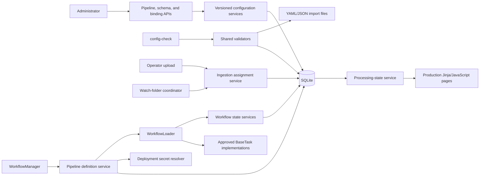

# Design: Multiple Versioned Pipeline Templates

## Document status

| Item | Value |
| --- | --- |
| Purpose | Implementation-ready design for multiple named, versioned processing pipelines and their review schemas |
| Audience | Engineers, architects, administrators, and test owners |
| Status | Proposed |
| Scope | Production application under `main.py`, `modules/`, `standard_step/`, `tools/config_check/`, and `web/` |
| Prerequisite | Current SQLite-backed batch, document, task-run, review, split, and audit model |
| Source direction | [Future Design: Multiple Pipeline Templates](future-multi-document-routing.md) |
| Deferred extension | [Future Design: Mixed-Document Pipeline Routing](future-mixed-document-routing.md) |

## Summary

The application currently loads one mutable `pipeline` and `tasks` definition
from runtime YAML. This design replaces that global execution definition with
multiple named pipeline templates whose published versions are immutable and
stored in SQLite. Review-form schemas follow the same model: the Review Forms
UI edits a schema draft in SQLite, publication creates an immutable schema
version, and a published pipeline references an exact schema version.

Every new batch and document is assigned an exact published pipeline version
before processing begins:

- an operator selects one version for an uploaded batch;
- each watch folder is bound to one version;
- split children inherit their source document's version;
- review resume, retry, and supported recovery paths reload the pinned version.

The runtime never substitutes the newest version after assignment. Publishing,
deactivating, renaming, or archiving a template cannot change an existing run.
SQLite remains authoritative for operational and configuration-version state,
while the filesystem remains authoritative for PDFs and other large artifacts.
YAML and JSON remain supported import/export and deployment-configuration
formats, but not authoritative runtime storage for pipelines or review
schemas.

This design preserves serial pipeline execution. Classification-driven
cross-pipeline routing is explicitly deferred.

## Goals

1. Allow administrators to create, edit, validate, publish, clone, deactivate,
   and archive independent pipeline templates.
2. Make every published definition immutable, reproducible, redacted for
   display, and addressable by a stable version identifier.
3. Require an explicit eligible pipeline version for every new ingestion.
4. Support multiple watch folders bound to different exact versions.
5. Ensure all execution paths use the version assigned at ingestion.
6. Preserve task approval, shared workflow context, review resume, split
   fan-out/fan-in, artifact registration, and SQLite workflow-state contracts.
7. Migrate the current active YAML pipeline without silently changing an
   in-progress document's visible task sequence.
8. Version review schemas independently and pin every review-gate task to an
   immutable schema version.
9. Preserve command-line validation for deployment YAML, add read-only
   validation of SQLite drafts/versions, and validate portable import/export
   files without making those files runtime authorities.

## Non-goals

- Automatic document classification or pipeline selection.
- Routing split children to different pipeline versions.
- Per-file pipeline choices within one uploaded batch.
- Arbitrary graphs, branches, joins, or user-authored routing expressions.
- Changing a document's assignment after processing starts.
- A distributed queue, multi-host workers, or new throughput model.
- General recovery of arbitrary interrupted Prefect flows.
- Rewriting historical extraction, review, artifact, or task-run results.
- Replacing SQLite or the local filesystem.
- Implementing production behavior only in
  `pipeline_visual_editor_prototype/`.

## Terminology

| Term | Meaning |
| --- | --- |
| Pipeline template | Stable administrative identity for a processing use case |
| Template key | Unique machine identifier such as `invoice-processing` |
| Pipeline draft | The single editable, revision-controlled definition for a template |
| Pipeline version | Immutable, published executable definition with a per-template version number |
| Review schema template | Stable identity for one review-form schema |
| Review schema draft | The single editable, revision-controlled schema for a schema template |
| Review schema version | Immutable published schema content with a per-template version number |
| Schema dependency | Exact review schema version required by one task in one pipeline version |
| Executable definition | Complete ordered task list and task configuration required to instantiate a workflow |
| Display snapshot | Redacted, parameter-free representation used by APIs and processing pages |
| Ingress binding | Mapping from a normalized watch-folder path to an exact published version |
| Assignment | Template and version pinned to a batch or document |
| Assignment source | `upload`, `watch_folder`, or `legacy_migration` |
| Secret reference | An unresolved `{"$secret": "alias"}` value stored in a definition |

Document type is optional descriptive metadata. It is not the primary pipeline
identity because different templates may process the same document type for
different business purposes.

## Current-state gaps

The existing implementation has the following gaps:

- `WorkflowLoader` reads one global `pipeline` and `tasks` configuration.
- `WorkflowManager` and `ResumeManager` reconstruct workflows from the current
  configuration rather than from an immutable assignment.
- `config_versions` stores draft/published copies of the single global
  configuration and publication rewrites active YAML.
- Batches store only a display snapshot in `metadata_json`; the snapshot omits
  task parameters and is not executable.
- Batches, documents, and task runs have no template or version foreign key.
- `WatchFolderMonitor` owns one configured input directory.
- The upload API has no pipeline selection field.
- The admin pipeline page assumes one active pipeline and one global draft.
- Review schemas are mutable YAML/JSON files, so editing a file can change the
  behavior of an otherwise unchanged pipeline.
- `ReviewGateTask` resolves `schema_file` from the filesystem at runtime and
  records a hash only after loading it; the hash is diagnostic, not a pinned
  dependency.
- `tools.config_check` assumes `pipeline` and `tasks` live in the YAML file
  supplied through `--config`, so it has no source selector for SQLite drafts
  or published versions.

The display snapshot must not be promoted into an executable definition. It
intentionally excludes parameters and secrets.

## Architectural decisions

### SQLite is authoritative

SQLite owns pipeline and review-schema template identity, draft state,
immutable versions, pipeline-to-schema dependencies, watch-folder bindings,
ingestion assignments, task-run attribution, and audit history. Runtime YAML
no longer owns `pipeline`, `tasks`, or review schemas after migration.

The existing `config_versions` table remains readable as legacy configuration
history. New pipeline administration does not write pipeline drafts or
published definitions to that table and does not rewrite global `pipeline` or
`tasks` YAML sections.

Small configuration documents belong in SQLite under this model. The
filesystem remains authoritative for PDFs, exports, reference CSVs, and other
large business artifacts.

### Published definitions are immutable

A version contains the complete unresolved executable definition. Publication
assigns the next integer version number within the template. The definition,
content hash, version number, template relationship, author, and publication
time cannot be updated or deleted.

Template display metadata and lifecycle state remain mutable because those
changes do not alter execution. Existing runs may load a version belonging to
an inactive or archived template.

Review schema versions use the same immutability rule. A pipeline version
references a schema version ID, never a mutable schema key, file name, draft,
or implicit latest version.

### YAML and JSON are interchange formats

Runtime `config.yaml` continues to hold deployment concerns such as database,
web, authentication, paths, custom-task approval, and `pipeline_secrets`.
Pipeline and review-schema YAML/JSON files are accepted for validation,
import, export, backup, and source-control workflows, but the running
application does not load them after publication.

Imports create or update drafts only. An explicit publish operation is still
required. Exports contain no resolved secrets and use portable stable keys
plus version numbers/content hashes instead of database UUIDs.

### Selection happens before ingestion records are created

The application resolves and authorizes the submitted version before creating
the batch and document rows or scheduling background work. A missing, unknown,
inactive, unpublished, corrupt, or unauthorized selection is rejected. There
is no default fallback.

The same version applies to every root document in one uploaded batch.

### Runtime loaders receive definitions explicitly

Workflow construction must not consult global `pipeline` or `tasks` values.
The assigned version is loaded, integrity-checked, secret-resolved, and passed
to workflow construction explicitly.

### Secret values are not versioned

Definitions store secret references, not credentials. Secret values remain
deployment configuration and may rotate without creating a new workflow
version. The unresolved reference participates in the version content hash;
the resolved value never does.

### `workflow_runs` is deferred

One document executes one pipeline version in this release, so task runs can
refer directly to that version. A separate `workflow_runs` entity is deferred
until mixed-document routing allows one document to execute parts of multiple
versions.

## Target architecture



Route handlers continue to own authentication, authorization, request
validation, and response construction. Cross-table operations belong in
services. Table-specific persistence belongs in repositories.

## Persistence model

### `review_schema_templates`

| Column | Contract |
| --- | --- |
| `id` | UUID text primary key |
| `schema_key` | Lowercase kebab-case key, unique case-insensitively |
| `name` | Required administrator-facing name |
| `description` | Optional purpose and usage guidance |
| `status` | `active`, `inactive`, or `archived` |
| `created_by`, `created_at` | Creation attribution |
| `updated_by`, `updated_at` | Last metadata/lifecycle change |
| `archived_at` | Set only when status becomes `archived` |

Schema keys follow the pipeline template-key syntax and become immutable after
first publication. New schema templates start inactive. Activation requires a
published version, and archiving requires inactive status. Archived schema
versions remain readable for existing pinned pipelines, but cannot be selected
or newly published from a pipeline draft. A pipeline draft that already points
to one receives a blocking validation finding until the reference is changed.

### `review_schema_drafts`

| Column | Contract |
| --- | --- |
| `schema_template_id` | Primary key and foreign key to `review_schema_templates` |
| `revision` | Positive integer optimistic-concurrency token |
| `base_version_id` | Published schema version from which the draft derives, nullable before first publish |
| `schema_json` | Canonical normalized review-form schema |
| `content_hash` | SHA-256 of canonical `schema_json` |
| `updated_by`, `updated_at` | Last draft update attribution |

There is exactly one draft per non-archived schema template. It follows the
same `expected_revision`/HTTP `409` concurrency contract as a pipeline draft.

### `review_schema_versions`

| Column | Contract |
| --- | --- |
| `id` | UUID text primary key |
| `schema_template_id` | Foreign key to `review_schema_templates` |
| `version_number` | Positive integer, monotonically increasing per schema template |
| `format_version` | Review-schema contract version, initially `1` |
| `schema_json` | Canonical immutable normalized schema |
| `content_hash` | SHA-256 of canonical `schema_json` |
| `validation_summary_json` | Non-secret publication validation summary |
| `published_by`, `published_at` | Publication attribution |

Required constraints are
`UNIQUE(schema_template_id, version_number)` and
`UNIQUE(id, schema_template_id)`. SQLite triggers reject updates and deletes.
Schema publication uses the same `BEGIN IMMEDIATE`, stale-revision check,
monotonic numbering, draft-base update, and atomic audit behavior as pipeline
publication.

### `pipeline_version_schema_dependencies`

| Column | Contract |
| --- | --- |
| `pipeline_version_id` | Foreign key to `pipeline_versions` |
| `task_key` | Review-gate task key within the pipeline version |
| `schema_version_id` | Exact foreign key to `review_schema_versions` |

The primary key is `(pipeline_version_id, task_key)`. A unique constraint on
that pair guarantees one review schema per review-gate task. Dependency rows
are inserted in the pipeline publication transaction and are immutable. They
provide database-enforced referential integrity that cannot be obtained from
a UUID stored only inside JSON.

### `pipeline_templates`

| Column | Contract |
| --- | --- |
| `id` | UUID text primary key |
| `template_key` | Lowercase kebab-case key, unique case-insensitively |
| `name` | Required operator-facing name |
| `description` | Optional operator-facing purpose |
| `document_type` | Optional descriptive document type |
| `operator_instructions` | Optional upload guidance |
| `status` | `active`, `inactive`, or `archived` |
| `operator_selectable` | Boolean; controls operator upload visibility |
| `created_by`, `created_at` | Creation attribution |
| `updated_by`, `updated_at` | Last metadata/lifecycle change |
| `archived_at` | Set only when status becomes `archived` |

`template_key` must match `^[a-z][a-z0-9]*(?:-[a-z0-9]+)*$`. A key may be
changed while the template has no published versions. After first publication
it is immutable. `name`, `description`, `document_type`, and
`operator_instructions` may be changed without publishing a new definition.

New templates start `inactive`. Activation requires at least one published
version. `active` and `inactive` are reversible. Archiving requires the
template to be inactive and have no enabled watch-folder bindings. Archived is
a terminal lifecycle state in the first release; records and versions are
never deleted.

Administrators may manage and test every template. Operators may select only
active templates where `operator_selectable` is true.

### `pipeline_drafts`

| Column | Contract |
| --- | --- |
| `template_id` | Primary key and foreign key to `pipeline_templates` |
| `revision` | Positive integer optimistic-concurrency token |
| `base_version_id` | Published version from which the draft currently derives, nullable before first publish |
| `definition_json` | Canonical unresolved executable-definition JSON |
| `content_hash` | SHA-256 of canonical `definition_json` |
| `updated_by`, `updated_at` | Last draft update attribution |

There is exactly one draft per non-archived template. Saving a draft requires
the caller's `expected_revision`; a successful save increments `revision`.
Stale saves return HTTP `409` with the current revision and do not merge.

Publishing keeps the draft row, sets `base_version_id` to the newly published
version, and increments its revision. The definition remains identical, so
the editor immediately shows a clean draft based on the new version.

### `pipeline_versions`

| Column | Contract |
| --- | --- |
| `id` | UUID text primary key |
| `template_id` | Foreign key to `pipeline_templates` |
| `version_number` | Positive integer, monotonically increasing per template |
| `schema_version` | Executable-definition schema version, initially `1` |
| `definition_json` | Canonical unresolved executable definition |
| `content_hash` | SHA-256 of canonical `definition_json` |
| `display_snapshot_json` | Redacted, parameter-free processing snapshot |
| `validation_summary_json` | Non-secret publication validation summary |
| `published_by`, `published_at` | Publication attribution |

Required constraints:

- `UNIQUE(template_id, version_number)`;
- `UNIQUE(id, template_id)` to support composite assignment foreign keys;
- positive version number and supported schema version;
- no update or delete of a published row.

An SQLite trigger rejects updates and deletes from `pipeline_versions`.
Definition lifecycle is therefore distinct from mutable template lifecycle.
Every version of an active template remains eligible for explicit ingestion;
the newest is presented first. A future version-retirement feature may add a
separate lifecycle flag without mutating executable content.

### `watch_folder_bindings`

| Column | Contract |
| --- | --- |
| `id` | UUID text primary key |
| `folder_path` | Administrator-entered path for display |
| `normalized_path` | Canonical Windows comparison path, unique case-insensitively |
| `pipeline_template_id` | Template owning the selected version |
| `pipeline_version_id` | Exact published version |
| `enabled` | Boolean |
| `created_by`, `created_at` | Creation attribution |
| `updated_by`, `updated_at` | Last change attribution |

The version/template pair uses a composite foreign key to prevent mismatched
assignments. Paths are unique across enabled and disabled rows so that
disabling a binding cannot create an ambiguous duplicate.

The initial release rejects any pair of binding paths where one is nested
inside the other. This prevents two scans from claiming the same PDF through
overlapping directory trees. The coordinator does not recurse into
subdirectories.

### Assignment columns

Add the following target-state relationships:

| Table | Added columns |
| --- | --- |
| `batches` | `pipeline_template_id`, `pipeline_version_id`, `pipeline_assignment_source`, `ingress_binding_id` |
| `documents` | `pipeline_template_id`, `pipeline_version_id` |
| `task_runs` | `pipeline_version_id` |
| `review_items` | `review_schema_version_id` (nullable for non-schema review scopes) |

`pipeline_assignment_source` is constrained to `upload`, `watch_folder`, or
`legacy_migration`. `ingress_binding_id` is set only for watch-folder batches.

The template/version pair on batches and documents uses a composite foreign
key to guarantee that the version belongs to the stated template. Task runs
refer to the version directly and the service verifies that it equals the
document assignment. A schema-driven review item refers directly to the
immutable schema version selected by its pipeline dependency; creation fails
if the task JSON, dependency row, and review item would disagree.

After migration, assignment columns are required for every batch, document,
and task run. They are introduced as nullable only during the migration
transaction.

Required assignment invariants:

1. All root documents in a batch use the batch's version.
2. A child document uses its parent document's version.
3. A task run uses its document's version.
4. Once a non-null assignment exists, it cannot be replaced.
5. Template deactivation, archival, rename, or later publication does not
   change any assignment.

Repositories expose no general assignment-update method. Database triggers
reject changing a non-null batch or document version. Child creation and task
start services copy and verify assignments within their existing
transactions.

### Executable-definition shape

Version schema `1` is canonical JSON with this logical shape:

```json
{
  "schema_version": 1,
  "pipeline": [
    "split_document",
    "extract_invoice",
    "review_invoice",
    "store_invoice"
  ],
  "tasks": {
    "split_document": {
      "module": "standard_step.split.llama_cloud",
      "class": "LlamaCloudSplitTask",
      "params": {
        "enabled": true,
        "api_key": {"$secret": "llamacloud-primary"}
      },
      "on_error": "stop"
    },
    "review_invoice": {
      "module": "standard_step.review.review_gate",
      "class": "ReviewGateTask",
      "params": {
        "schema_version_id": "review-schema-version-uuid",
        "confidence_threshold": 0.8,
        "resume_policy": "next_task"
      },
      "on_error": "stop"
    }
  }
}
```

The definition includes only executable pipeline data. Template name,
description, lifecycle, version attribution, and ingress bindings remain
normalized metadata.

Canonicalization recursively sorts object keys, preserves array order, emits
UTF-8 JSON without insignificant whitespace, and rejects non-JSON values.
Task order is represented only by the `pipeline` array. The content hash is
calculated over canonical unresolved JSON.

`ReviewGateTask.params.schema_file` is replaced by
`schema_version_id`. Pipeline draft validation requires that the referenced
schema version exists, is published, and belongs to an active schema template.
Pipeline publication copies the relationship into
`pipeline_version_schema_dependencies` and verifies that the JSON ID and
dependency row agree.

Runtime review behavior loads schema content from the pinned dependency through
a SQLite-backed schema service. It never looks up a file name or a schema
template's newest version. The review item continues to record the schema
version ID and content hash for operator display and audit.

## Secret-reference contract

Runtime YAML retains a deployment-owned, non-versioned secret map:

```yaml
pipeline_secrets:
  llamacloud-primary: "deployment-managed-value"
  archive-service: "deployment-managed-value"
```

A secret reference is an object containing exactly one property:

```json
{"$secret": "llamacloud-primary"}
```

Aliases must match `^[a-z][a-z0-9]*(?:[-_][a-z0-9]+)*$`. The resolver walks
task parameters recursively and replaces only exact one-property reference
objects. It returns a new in-memory definition and never mutates or persists
the published version.

Security rules:

- secret-like parameter keys may contain references but not literal values;
- drafts, versions, diffs, audit events, logs, API responses, and display
  snapshots never contain resolved values;
- admin APIs expose the alias and a boolean `configured`, not its value;
- browser APIs cannot create or change secret values;
- publication fails when a reference is malformed or unresolved;
- execution also resolves references and fails closed if deployment
  configuration changed after publication;
- secret values are excluded from hashes, Prefect parameters, workflow
  context, task-run input/output JSON, and exception messages;
- rotating a secret value does not create a new pipeline version.

The migration moves existing secret-like task parameters into generated
aliases in `pipeline_secrets` and replaces their definition values with
references. Generated aliases use
`<template-key>-<task-key>-<parameter-name>`, with a numeric suffix on
collision. Migration code must not log values or include them in findings.

## Review schema lifecycle

### Create and edit

The Review Forms UI creates an inactive schema template and revision `1`
draft. It edits `review_schema_drafts.schema_json` with optimistic concurrency;
it does not write a runtime schema file.

Schema content retains the current logical contract: title, description,
fields, required markers, field types, choices, numeric constraints, object
properties, and array items. Canonical JSON is the database representation
even when the content was imported from YAML.

### Validate and publish

Schema validation operates on an explicit draft or submitted import. Publishing
requires a valid expected revision and creates the next immutable schema
version in one transaction. Publication does not update pipeline drafts or
versions automatically.

After publishing a new schema version, an administrator must select it in a
pipeline draft and publish a new pipeline version before new runs use it.
Existing pipeline versions and review resumes keep their prior schema version.

### Import and export

The Review Forms UI and CLI may import `.yaml`, `.yml`, or `.json` into a
schema draft. Import never publishes. Export may emit either canonical JSON or
human-readable YAML with stable schema key, version number, and content hash
metadata. Exported files are portable artifacts, not watched runtime inputs.

### Deactivate and archive

Inactive schema templates cannot be selected for a new pipeline draft, but
their published versions continue to serve already published pipelines.
Archived templates are hidden from normal selectors and remain available in
history and audit views. No lifecycle action rewrites a pipeline dependency.

## Pipeline template and version lifecycle

### Create

Creating a template requires a unique key and name. It creates an inactive
template and revision `1` draft with an empty pipeline. No version exists.

### Edit

Admins edit template metadata independently from the draft. Draft changes use
optimistic concurrency. Saving a draft does not affect existing or new
ingestion because only published versions are selectable.

### Validate

Validation operates on the submitted draft revision and returns structured,
path-addressable findings. Validation may be repeated without mutation.
Provider calls that consume external resources are not performed unless a
separate explicit live-check action is introduced.

### Publish

Publication follows this transaction boundary:

1. Normalize and validate the submitted definition outside the write
   transaction.
2. Start `BEGIN IMMEDIATE` to serialize publishers for that template.
3. Re-read the draft and reject a stale revision or changed content hash.
4. Re-run deterministic validation that depends on database state.
5. Reject publication when the draft is unchanged from `base_version_id`.
6. Assign `MAX(version_number) + 1`.
7. Insert the immutable version and display snapshot.
8. Update the draft's `base_version_id` and increment its revision.
9. Insert the audit event.
10. Commit all changes together.

Any failure rolls back the version, draft update, and audit event. Concurrent
publish attempts cannot create duplicate version numbers.

Publication does not activate a new template and does not change an existing
watch-folder binding.

### Clone

Cloning requires a source template with a published version. It copies the
source's latest published definition into revision `1` of a new inactive
template. The caller supplies the new key and name. No published version or
binding is copied, and secret aliases remain references to the same deployment
secrets until the administrator deliberately changes them.

### Deactivate and archive

Deactivation prevents new uploads and new watch-folder assignment after the
coordinator's next reconciliation. Pinned documents continue.

Archiving requires an inactive template and no enabled bindings. Archived
templates and versions remain queryable to authorized administrators and
remain loadable for pinned execution, review resume, and audit.

## Ingestion design

### Available-pipeline query

`GET /api/pipelines/available?source=upload` is available to authenticated
operators and administrators. It returns one item per published version of an
eligible active template, newest first:

```json
{
  "items": [
    {
      "template_id": "template-uuid",
      "template_key": "invoice-processing",
      "name": "Invoice Processing",
      "description": "Extract and review supplier invoices",
      "document_type": "invoice",
      "operator_instructions": "Upload one supplier batch at a time.",
      "pipeline_version_id": "version-uuid",
      "version_number": 3,
      "published_at": "2026-07-25T10:00:00Z",
      "step_count": 5
    }
  ]
}
```

Operators see only `operator_selectable` templates. Administrators see every
active template. The response contains no task parameters.

### Batch upload

`POST /api/batches/upload` remains multipart and adds one required scalar form
field:

```text
pipeline_version_id=<version UUID>
files=<PDF>
files=<PDF>
```

The route performs these operations in order:

1. Parse exactly one `pipeline_version_id`.
2. Resolve the version, verify its hash, validate template eligibility, and
   authorize the current role.
3. Validate all file names, sizes, content types, and PDF headers.
4. Save files to collision-safe processing paths.
5. In one SQLite transaction, create the batch, root documents, source
   artifacts, assignment fields, and upload-selection audit event.
6. Schedule one background workflow per document with its IDs and pinned
   version.

If database creation fails, saved files are removed using the existing
compensation pattern. A batch is never created with a partial or inferred
assignment.

The response adds a redacted pipeline summary:

```json
{
  "batch_id": "batch-uuid",
  "document_ids": ["document-uuid"],
  "status": "queued",
  "pipeline": {
    "template_key": "invoice-processing",
    "name": "Invoice Processing",
    "pipeline_version_id": "version-uuid",
    "version_number": 3
  }
}
```

Missing, repeated, malformed, unknown, inactive, archived, or unauthorized
selections return a safe `4xx` response. The server never selects a default.

### Watch-folder coordinator

The parent process replaces the single-folder startup path with a coordinator
that scans all enabled bindings sequentially during each polling cycle. This
preserves the current local-process and sequential-watch-ingestion model.

Path normalization on Windows is:

1. expand user syntax;
2. make the path absolute relative to the active configuration directory;
3. call `Path.resolve(strict=False)`;
4. apply `os.path.normcase`;
5. remove trailing separators except for a filesystem root.

Binding create/update validation rejects:

- duplicate normalized paths;
- nested paths in either direction;
- nonexistent or inaccessible folders;
- paths that are not directories;
- unknown or unpublished versions;
- inactive or archived templates for enabled bindings.

The coordinator refreshes binding rows at least once per existing polling
interval. Reconciliation and file claiming use one coordinator lock:

- additions begin scanning on the next cycle;
- disabled or invalidated bindings stop accepting new files;
- a version change applies only after the refreshed binding snapshot;
- a file already moved to the processing directory is treated as claimed and
  keeps the captured version;
- binding changes never rewrite an existing batch or document.

The coordinator moves each accepted PDF into the shared processing directory,
then creates a one-document batch with assignment source `watch_folder` and
the binding ID. Existing retry and invalid-header behavior remains. A binding
or folder error produces a startup/admin validation finding without stopping
unrelated bindings.

## Execution design

### Pipeline definition service

A new pipeline-definition service is the only runtime path that reads
published definition content. Given a version ID, it:

1. reads the immutable version and template;
2. recalculates and compares the content hash;
3. parses and validates the supported schema version;
4. loads every normalized schema dependency and verifies its content hash;
5. verifies each review task's `schema_version_id` against the dependency row;
6. resolves secret references into a new in-memory object;
7. validates approved module/class pairs;
8. returns an executable definition, immutable schema map, and redacted
   metadata.

There is no fallback to active YAML or the latest version. Corrupt,
unsupported, or unresolved definitions produce `TaskSetupError`-equivalent
safe failures.

### Workflow manager and loader

`WorkflowManager.trigger_workflow_for_file` accepts
`pipeline_version_id`. When a SQLite document ID is present, the manager reads
the authoritative assignment and rejects any conflicting caller value.

`WorkflowLoader` is constructed with an executable definition and version ID.
Its current singleton behavior must be removed or replaced so definitions
cannot leak between runs. `load_workflow` iterates the supplied definition,
not `ConfigManager.get("pipeline")`.

`ReviewGateTask` receives the immutable schema map through an injected
SQLite-backed schema provider or an explicit resolved-schema constructor
argument. It does not instantiate the legacy filesystem `SchemaService` for
published execution. The shared workflow context does not carry full schema
content.

Initial workflow context may carry:

```python
{
    "pipeline_template_id": "...",
    "pipeline_version_id": "...",
}
```

These values are conveniences for task attribution. SQLite remains
authoritative, and tasks may not mutate the assignment.

Task start:

- writes `task_runs.pipeline_version_id`;
- verifies it matches the document assignment;
- records task key and index from the pinned definition;
- uses resolved parameters only for in-memory task construction;
- never persists secret-bearing parameters.

The internal cleanup task uses the pinned pipeline length for its index and
records the same version ID without moving the configured task cursor.

### Split fan-out and fan-in

The split task continues to create child PDFs and child document rows.
`DocumentRepository.create_child` copies the parent template and version
inside the same transaction as child creation. An attempted different
assignment is rejected.

`WorkflowManager` loads the child assignment and starts at the next task index
in the same definition. Extraction preflight reads resolved parameters from
that definition. Split retry, compensation, artifact registration, and
leaf-derived fan-in otherwise remain unchanged.

### Review pause and resume

`ResumeManager` no longer caches the global pipeline in its constructor. It
loads the document, resolves its pinned version, and computes the next task
from that version.

Resume ordering is:

1. Read the document and require `review_completed`.
2. Resolve and integrity-check the pinned definition and schema dependencies.
3. Calculate the next pinned task and check pinned-version task runs for
   completed downstream work.
4. Atomically claim `review_completed -> resuming`.
5. Reconstruct context from SQLite.
6. create a loader from the pinned definition and start at the next index.

Definition or secret-resolution failure occurs before the resume claim, leaves
the document `review_completed`, and returns an operator-safe retriable
failure. Duplicate completion/resume requests remain protected by the atomic
document transition.

### Retry and supported recovery

Prefect task retries reuse the already constructed pinned workflow. Review
resume and split-child launch reload the same version. Existing administrative
re-ingestion creates a new batch and therefore requires a new explicit
selection.

This feature does not add arbitrary interrupted-flow recovery. If a future
recovery command is introduced, its contract must use the stored assignment
and must never infer the current latest version.

### Failure behavior

- An ingestion-selection failure creates no workflow state.
- A missing secret before initial execution marks the affected document
  failed with a safe setup reason and runs normal fan-in handling where
  possible.
- A missing secret during review resume leaves the document resumable.
- A hash mismatch or unsupported definition fails closed and emits an audit
  event without definition content.
- Deactivation or archival never fails already assigned work.
- No failure path loads global `pipeline` or `tasks` as a substitute.

## Services and repositories

New or expanded service responsibilities:

| Service | Responsibility |
| --- | --- |
| Review schema template service | Schema metadata, lifecycle, and selector eligibility |
| Review schema draft service | Revision-controlled schema editing and import |
| Review schema publication service | Schema validation, immutable publication, history, and export |
| Template service | Template CRUD, lifecycle rules, cloning, role eligibility |
| Draft service | Revision-controlled draft reads and writes |
| Publication service | Validation, version numbering, immutable publication, redacted diff |
| Pipeline definition service | Runtime integrity check, schema dependency loading, and secret resolution |
| Ingress binding service | Path normalization, overlap checks, exact-version bindings |
| Ingestion assignment service | Atomic batch/document creation and authorization |
| Processing-state service | Version-derived redacted snapshots and labels |
| Validation facade | Shared validation entry point for API, CLI, database objects, and import files |

Table-specific SQL belongs in repository classes. Services coordinate
cross-table invariants and audit insertion. `modules/api_router.py` must not
absorb template lifecycle, publication, binding, or assignment business logic.

## API design

### Administrator endpoints

All endpoints require the fixed `admin` role and existing CSRF protection for
cookie-authenticated mutations.

| Method and path | Purpose |
| --- | --- |
| `GET /api/admin/review-schemas` | List schema templates with latest version and draft summary |
| `POST /api/admin/review-schemas` | Create inactive schema template and empty draft |
| `GET /api/admin/review-schemas/{schema_template_id}` | Get schema metadata, draft summary, and versions |
| `PATCH /api/admin/review-schemas/{schema_template_id}` | Update metadata or lifecycle state |
| `GET /api/admin/review-schemas/{schema_template_id}/draft` | Read schema draft and revision |
| `PUT /api/admin/review-schemas/{schema_template_id}/draft` | Save schema draft using `expected_revision` |
| `POST /api/admin/review-schemas/{schema_template_id}/draft/validate` | Validate submitted or stored schema draft |
| `POST /api/admin/review-schemas/{schema_template_id}/draft/publish` | Publish exact expected schema revision |
| `GET /api/admin/review-schemas/{schema_template_id}/versions` | List immutable schema versions |
| `GET /api/admin/review-schema-versions/{schema_version_id}` | Read immutable schema version |
| `POST /api/admin/review-schemas/{schema_template_id}/draft/import` | Validate and import YAML/JSON into the selected draft |
| `GET /api/admin/review-schemas/{schema_template_id}/draft/export` | Export the current draft as portable YAML or JSON |
| `GET /api/admin/review-schema-versions/{schema_version_id}/export` | Export redacted portable YAML or JSON |
| `GET /api/admin/pipeline-templates` | List templates with latest version and draft summary |
| `POST /api/admin/pipeline-templates` | Create inactive template and empty draft |
| `GET /api/admin/pipeline-templates/{template_id}` | Get metadata, draft summary, versions, and bindings |
| `PATCH /api/admin/pipeline-templates/{template_id}` | Update metadata or perform a valid lifecycle transition |
| `POST /api/admin/pipeline-templates/{template_id}/clone` | Clone latest published definition into a new template |
| `GET /api/admin/pipeline-templates/{template_id}/draft` | Read redacted draft and revision |
| `PUT /api/admin/pipeline-templates/{template_id}/draft` | Save draft using `expected_revision` |
| `POST /api/admin/pipeline-templates/{template_id}/draft/import` | Validate a portable bundle and import it into the draft |
| `GET /api/admin/pipeline-templates/{template_id}/draft/export` | Export the current draft as a portable redacted bundle |
| `POST /api/admin/pipeline-templates/{template_id}/draft/validate` | Validate submitted or stored revision |
| `POST /api/admin/pipeline-templates/{template_id}/draft/publish` | Publish exact expected revision |
| `GET /api/admin/pipeline-templates/{template_id}/versions` | List immutable version metadata |
| `GET /api/admin/pipeline-versions/{version_id}` | Read redacted version and display snapshot |
| `GET /api/admin/pipeline-versions/{version_id}/export` | Export a portable redacted bundle with schema dependencies |
| `GET /api/admin/pipeline-versions/{left_id}/diff/{right_id}` | Return redacted canonical diff |
| `GET /api/admin/watch-folder-bindings` | List bindings and validation state |
| `POST /api/admin/watch-folder-bindings` | Create exact-version binding |
| `PATCH /api/admin/watch-folder-bindings/{binding_id}` | Update path, version, or enabled state |
| `DELETE /api/admin/watch-folder-bindings/{binding_id}` | Delete only a disabled, never-used binding |

Bindings referenced by batches cannot be deleted; they remain disabled
historical records. The delete endpoint returns `409` in that case.

Published schema versions referenced by
`pipeline_version_schema_dependencies` cannot be deleted. The API provides no
delete operation for schema versions or pipeline versions.

Draft save request:

```json
{
  "expected_revision": 4,
  "definition": {
    "schema_version": 1,
    "pipeline": ["extract_invoice"],
    "tasks": {
      "extract_invoice": {
        "module": "standard_step.extraction.llama_cloud_v2",
        "class": "ExtractPdfTask",
        "params": {
          "api_key": {"$secret": "llamacloud-primary"},
          "configuration_id": "invoice-config"
        },
        "on_error": "stop"
      }
    }
  }
}
```

Publish request:

```json
{
  "expected_revision": 5,
  "expected_content_hash": "sha256..."
}
```

Validation and conflict responses contain stable codes and JSON paths, never
raw secret-bearing values.

### Status codes

| Status | Meaning |
| --- | --- |
| `400` | Malformed business input such as an invalid key or path |
| `401` | Missing or invalid authentication |
| `403` | Authenticated role is not permitted |
| `404` | Unknown template, version, draft, or binding |
| `409` | Stale revision, invalid lifecycle transition, binding conflict, or immutable-resource conflict |
| `422` | Draft or publication validation contains blocking findings |

### Existing single-pipeline endpoints

The existing `/api/admin/pipeline` single-resource endpoints are internal to
the current production page and are replaced atomically with the endpoints
above when the new page ships. They do not continue writing active YAML.
External compatibility is not promised for these administrative endpoints.

The existing file-backed schema administration endpoints are likewise
replaced atomically by the versioned review-schema endpoints. YAML/JSON upload
becomes draft import, and download becomes explicit export. No API mutation
writes into `schema.directories` after migration.

Legacy processing/status APIs remain compatibility-only and must not become a
new source of pipeline assignment or execution state.

## Production UI design

### Review Forms workspace

The production Review Forms page becomes a versioned schema workspace. It
provides:

- schema-template list and lifecycle badges;
- one revision-controlled draft per schema template;
- the existing typed field editor over canonical draft JSON;
- validation findings before save and publish;
- immutable version history and content-hash display;
- YAML/JSON import into the draft;
- YAML/JSON export from a draft or published version;
- usage information listing pipeline drafts and versions that depend on each
  schema version.

Editing or publishing a schema never changes a pipeline automatically. After
schema publication, the UI offers a navigation link to pipeline administration
so an admin can select the new version and publish a corresponding pipeline
version.

### Administrator pipeline workspace

The production `/app/admin/pipeline` page remains Jinja with a page-specific
vanilla JavaScript controller. It gains:

- template list with lifecycle and latest-version badges;
- create and clone actions;
- metadata and operator-instruction editor;
- active/inactive/archive controls with prerequisite explanations;
- existing ordered task editor scoped to the selected template draft;
- visible draft revision and stale-save conflict recovery;
- validation findings and redacted YAML/JSON preview;
- publish action with assigned version number;
- immutable version history and redacted diff;
- review-gate schema selector showing active published schema versions, exact
  version numbers, hashes, and compatibility findings;
- watch-folder binding list and exact-version selector.

Changing the selected template reloads its server-side draft. Unsaved changes
must trigger the existing-style navigation confirmation. The UI never stores
draft state as authoritative browser storage.

### Upload page

The upload page fetches available versions before enabling processing. It
requires one selection and shows:

- name and description;
- intended document type;
- operator instructions;
- explicit version number and publication time.

No item is implicitly selected on first load, even when only one is available.
The start button requires valid files and a current selection. If the version
becomes ineligible before submission, the API rejects it and the page refreshes
the list without choosing another version.

### Processing pages

Batch and document responses include:

```json
{
  "pipeline": {
    "template_id": "template-uuid",
    "template_key": "invoice-processing",
    "name": "Invoice Processing",
    "pipeline_version_id": "version-uuid",
    "version_number": 3,
    "display_snapshot": {
      "version": 1,
      "step_count": 5,
      "steps": []
    }
  }
}
```

`ProcessingStateService` reads the immutable version snapshot. It uses the old
batch `metadata_json.pipeline_snapshot` only for migration diagnostics, not
for new batches. Grouping uses `pipeline_version_id`, not only a content hash.

Template metadata shown for an old run may reflect a renamed display name;
the version number and task snapshot remain immutable. Audit views retain the
name/key snapshot recorded by the assignment event.

Tailwind CSS is rebuilt if new utility classes are introduced.

## Validation

### Template and draft validation

Blocking validation includes:

- invalid or duplicate template key;
- missing template name;
- activation without a published version;
- archival with enabled bindings;
- unsupported definition schema version;
- non-object tasks or missing/empty pipeline;
- duplicate or unknown pipeline task keys;
- invalid `on_error`;
- unapproved module/class pair;
- class not inheriting from `BaseTask`;
- invalid task order or task-specific parameters;
- missing extraction or review configuration;
- literal values under secret-like keys;
- malformed or unresolved secret references;
- non-JSON values;
- missing, inactive, archived, or invalid `schema_version_id` references;
- a review task JSON reference that disagrees with its normalized dependency;
- schema fields incompatible with the configured extraction output;
- unsafe filesystem paths used by non-schema task parameters;
- publication identical to the base version.

The existing pipeline validator and standalone config-check rules should be
refactored to validate an explicit definition plus resolved dependency
metadata rather than assume root-level global YAML.

### Review schema validation

The existing review schema rules remain, but operate on explicit canonical
schema content from a draft, version, or import file. Blocking findings
include:

- missing or invalid `fields` mapping;
- unsupported field types;
- invalid required-field declarations;
- enum without choices or a default outside those choices;
- invalid numeric minimum, maximum, or step;
- object without properties;
- array without an item definition;
- incompatible properties on scalar array items;
- malformed nested structures;
- unsupported review-schema format version;
- publication identical to the base version.

Published schema versions are already validated and immutable. Routine runtime
loading verifies format version and content hash rather than reinterpreting an
unpublished file.

### Binding validation

Binding validation runs on mutation, coordinator reconciliation, startup
validation, and admin validation pages. It detects invalid paths, path
overlaps, inaccessible folders, missing versions, inactive templates, and
enabled bindings that no longer meet ingestion rules.

Publishing one template never validates or mutates another template except
that shared secret availability and referenced immutable schema versions may
produce independent findings.

## Command-line validation design

### Source model

`tools.config_check` remains the supported Windows-first validation CLI, but
`--config` changes meaning after migration. It identifies deployment settings,
the SQLite database, task-approval policy, paths, and secret aliases. It does
not imply that the YAML file contains the authoritative pipeline or review
schema.

All API, UI, startup, and CLI validation paths call a shared validation facade
with an explicit source:

- runtime deployment configuration;
- SQLite pipeline draft or published version;
- SQLite review schema draft or published version;
- all active SQLite objects and bindings;
- portable pipeline/schema import file.

Validators accept parsed dictionaries and dependency resolvers. YAML parsing,
SQLite reads, API request parsing, and CLI argument handling are adapters, not
separate rule implementations.

### Commands

The existing command remains valid:

```powershell
.\.venv\Scripts\python.exe -m tools.config_check validate `
  --config .\config.yaml --import-checks
```

After migration, this default command validates:

1. deployment YAML and path/security settings;
2. database availability and schema version;
3. configured secret aliases without displaying values;
4. every active pipeline template's published versions eligible for new work;
5. their immutable review-schema dependencies;
6. every enabled watch-folder binding.

It does not validate ignored legacy root-level `pipeline`, `tasks`, or
filesystem review-schema content as active runtime definitions. Their presence
produces a migration/deprecation warning until they are removed.

Targeted selectors are added:

```powershell
# Validate one stored pipeline draft.
.\.venv\Scripts\python.exe -m tools.config_check validate `
  --config .\config.yaml --pipeline invoice-processing --draft

# Validate one immutable pipeline version and its exact dependencies.
.\.venv\Scripts\python.exe -m tools.config_check validate `
  --config .\config.yaml --pipeline invoice-processing --version 3 `
  --import-checks --check-files

# Validate one stored review schema draft or version.
.\.venv\Scripts\python.exe -m tools.config_check validate `
  --config .\config.yaml --review-schema invoice-review --draft

.\.venv\Scripts\python.exe -m tools.config_check validate `
  --config .\config.yaml --review-schema invoice-review --version 2

# Validate every draft, version, active assignment dependency, and binding.
.\.venv\Scripts\python.exe -m tools.config_check validate `
  --config .\config.yaml --all-stored
```

`--pipeline` and `--review-schema` accept stable keys, not database UUIDs.
Exactly one of `--draft` or `--version` is required with a targeted selector.
`--pipeline` and `--review-schema` are mutually exclusive. `--all-stored`
cannot be combined with a target.

### Portable file validation

YAML and JSON validation remains available for content that will be imported
or deployed:

```powershell
# Deployment YAML only; does not open SQLite.
.\.venv\Scripts\python.exe -m tools.config_check validate-file `
  --kind runtime --file .\config.yaml

# Pipeline bundle before import. --config allows dependency and secret-alias checks.
.\.venv\Scripts\python.exe -m tools.config_check validate-file `
  --kind pipeline --file .\invoice-pipeline.yaml --config .\config.yaml `
  --import-checks --check-files

# Review schema before import.
.\.venv\Scripts\python.exe -m tools.config_check validate-file `
  --kind review-schema --file .\invoice-review.yaml
```

`validate-file` is read-only and never imports, saves, publishes, migrates, or
rewrites a file. Pipeline portability bundles identify schema dependencies by
stable schema key, version number, and content hash. When `--config` is
provided, the CLI resolves those coordinates against the target SQLite
database and rejects a hash mismatch. Without a database, the bundle must
embed the referenced exported schema content; otherwise unresolved
dependencies are blocking findings.

Portable pipeline YAML uses coordinates rather than local UUIDs:

```yaml
kind: pipeline-bundle
format_version: 1
template:
  key: invoice-processing
  name: Invoice Processing
definition:
  pipeline:
    - review_invoice
  tasks:
    review_invoice:
      module: standard_step.review.review_gate
      class: ReviewGateTask
      params:
        schema:
          key: invoice-review
          version: 2
          content_hash: "sha256..."
        confidence_threshold: 0.8
      on_error: stop
dependencies:
  review_schemas:
    - key: invoice-review
      version: 2
      content_hash: "sha256..."
      schema: {} # Required only for fully offline validation/import.
```

On import, the resolver replaces the portable `schema` coordinate with the
target database's `schema_version_id`; the stored draft never retains both
forms. Export performs the inverse conversion. A bundle cannot request
`latest`.

Import APIs and commands run `validate-file` semantics first, resolve portable
coordinates to local UUIDs, and then save a draft. Import never publishes.

### CLI compatibility and output

- `--format text|json`, `--strict`, `--base-dir`, `--import-checks`,
  `--check-files`, `--performance-analysis`, and `--security-analysis` remain
  supported where applicable.
- Import checks verify approved module/class resolution for the selected
  pipeline definition.
- File checks validate non-schema task file dependencies such as reference
  CSVs and writable directories. Review schema content comes from SQLite or
  the validated bundle, not `schema.directories`.
- Exit codes remain `0` for valid, `1` for errors, `2` for warnings only, and
  `64` for command usage errors.
- JSON finding paths identify their source, for example
  `pipeline:invoice-processing@draft.tasks.review.params.schema_version_id` or
  `review-schema:invoice-review@2.fields.invoice_date`.
- Database-backed validation opens SQLite read-only, does not run migrations,
  and returns a blocking finding when the database schema is too old.
- Reporters redact secret-like keys and values consistently for file and
  database inputs.
- A flag that does not apply to the selected source returns usage exit code
  `64`; it is never silently ignored.
- `config-check schema` gains
  `--kind runtime|pipeline|review-schema|pipeline-bundle` so automation can
  retrieve each portable contract.

## Authorization, audit, and redaction

### Authorization

- Admins manage templates, drafts, versions, and bindings.
- Operators list and select only active `operator_selectable` templates.
- Admins may upload using any active template.
- The watch coordinator uses enabled bindings and does not impersonate a user.
- Assignment authorization occurs server-side at ingestion; hidden UI controls
  are not authorization.

### Audit events

At minimum, record:

- `review_schema_template_created`;
- `review_schema_template_metadata_updated`;
- `review_schema_template_activated`;
- `review_schema_template_deactivated`;
- `review_schema_template_archived`;
- `review_schema_draft_saved`;
- `review_schema_draft_imported`;
- `review_schema_draft_validated`;
- `review_schema_version_published`;
- `review_schema_version_exported` when required by audit policy;
- `pipeline_template_created`;
- `pipeline_template_metadata_updated`;
- `pipeline_template_cloned`;
- `pipeline_template_activated`;
- `pipeline_template_deactivated`;
- `pipeline_template_archived`;
- `pipeline_draft_saved`;
- `pipeline_draft_imported`;
- `pipeline_draft_validated`;
- `pipeline_version_published`;
- `pipeline_version_exported` when required by audit policy;
- `pipeline_version_diff_viewed` when required by audit policy;
- `watch_folder_binding_created`;
- `watch_folder_binding_updated`;
- `watch_folder_binding_disabled`;
- `watch_folder_binding_deleted`;
- `pipeline_selected_for_upload`;
- `pipeline_assigned_from_watch_folder`;
- `pipeline_assignment_migrated`;
- `pipeline_definition_integrity_failed`;
- `pipeline_secret_resolution_failed`.

Events include stable IDs, version number, template key/name snapshot, actor,
outcome, and non-secret summary. Upload selection is attributed to the current
user. Binding assignment is attributed to `system` plus the binding ID.
Read-only local CLI validation does not create audit events; API-driven
validation and import retain their existing audit expectations.

### Redaction

All definition-returning paths use one shared recursive redactor. Secret
references may display the alias and configured state, but values are never
returned. Definition parse errors report JSON paths and types rather than
echoing values.

Tests, fixtures, screenshots, logs, diffs, audit payloads, task-run JSON, and
error responses use synthetic aliases and cannot contain real credentials.

## Migration design

### Schema migration

The next database schema version is `3`. The migration runner must perform an
explicit ordered upgrade because replaying `CREATE TABLE IF NOT EXISTS` does
not add columns to existing tables.

Upgrade order:

1. Create the eight new pipeline/schema/binding tables and their base indexes.
2. Add nullable assignment columns to existing tables.
3. Discover every managed YAML/JSON review schema under the configured legacy
   schema directories.
4. Validate and import each schema as a schema template, version `1`, and
   matching draft.
5. Read and normalize the active YAML `pipeline` and `tasks`.
6. Replace each review task's `schema_file` with the imported
   `schema_version_id` and create normalized dependency rows.
7. Extract secret-like values into `pipeline_secrets` aliases and atomically
   update runtime YAML without logging values.
8. Create the default pipeline template, version `1`, and a
   revision-controlled draft.
9. Compare non-terminal batch snapshots with the migrated display snapshot.
10. Backfill batch, document, and task-run assignments.
11. Insert migration audit events.
12. Verify assignment, schema-dependency, and referential invariants.
13. Install immutability and assignment triggers and record schema version `3`.

The configuration-file update uses a same-directory temporary file and atomic
replace. File permissions are preserved where supported. A recoverable backup
may contain the same secrets already present in the source YAML and must use
the source file's access controls; its path is never logged at a level exposed
to operators.

If database or configuration migration fails, startup stops before the watch
coordinator or web server accepts new work. The database transaction rolls
back. Configuration compensation restores the original YAML when replacement
already occurred.

### Review schema import

Every valid `.yaml`, `.yml`, or `.json` file visible through the legacy
`schema.directories` configuration is imported once. The normalized file stem
becomes the proposed schema key; collisions use a deterministic numeric suffix
and produce a migration warning.

Referenced schema files are mandatory:

- a missing or invalid file referenced by `ReviewGateTask.schema_file` blocks
  migration;
- duplicate references to the same resolved file share one imported schema
  version;
- two files with identical content remain separate templates unless they
  resolve to the same canonical path;
- templates imported from an active pipeline reference become active;
  unreferenced valid imports remain inactive until an administrator activates
  them;
- unreferenced invalid files are reported and skipped, because they did not
  participate in active execution;
- no imported schema is treated as authoritative until its database insert and
  migration audit commit.

The original files are not deleted automatically. After successful migration
they are legacy import sources only. `schema.directories` may remain
temporarily for migration and explicit file-import browsing, but runtime
review execution and the Review Forms UI do not read or write those files.

The migration records the original safe file name and content hash in audit
metadata, never the full content when it may contain customer-specific field
descriptions.

### Default template

The active YAML becomes:

- key: `default-processing`;
- name: `Default Processing`;
- status: `active`;
- operator selectable: `true`;
- published version: `1`;
- draft base version: version `1`;
- assignment source for backfilled rows: `legacy_migration`.

If the key already exists from an idempotent partial attempt, migration must
identify the same content hash or stop with a conflict. It must not create a
second default template.

### Non-terminal compatibility gate

The migration classifies `completed`, `completed_with_errors`, `failed`, and
`cancelled` as terminal. Every other document or batch status is treated as
non-terminal, including review-completed documents awaiting resume.

For each non-terminal legacy batch:

1. Read `metadata_json.pipeline_snapshot`.
2. Require a valid snapshot and compare its content hash with the display
   snapshot derived from migrated version `1`.
3. For every schema-driven review item or review task output that records a
   legacy schema hash, require it to match the imported schema version.
4. Backfill `review_items.review_schema_version_id` where the dependency is
   identifiable.
5. Pin the batch, documents, and existing task runs only when all available
   hashes match.
6. Stop startup on a missing pipeline snapshot, mismatched pipeline hash,
   mismatched review schema hash, or ambiguous review-schema dependency.

This is the strongest available compatibility check because legacy snapshots
did not preserve parameters and pre-gate documents did not persist schema
identity. A document that has not reached its review gate is pinned to the
schema content active at migration—the same content the legacy runtime would
load next. The remediation message instructs the operator to either:

- run the old application/configuration until the work becomes terminal;
- restore a matching active definition and rerun migration; or
- fail/cancel and re-ingest the affected work under an explicit version.

Migration never silently pins a visibly different task sequence.

Terminal historical rows are assigned version `1` for referential integrity
and UI grouping and are marked `legacy_migration` in the batch and audit
event. The UI may label their executable provenance as migration-derived; it
must not claim that version `1` reproduces parameters used by a historical
completed run. The same provenance limitation applies to historical review
schemas when no legacy review item or task output recorded a matching hash.

### Legacy configuration history

`config_versions` rows are not transformed into pipeline versions because
they may contain global settings, incomplete drafts, or content that was never
executed. They remain available to existing audit/reporting tools as legacy
history.

After successful migration, runtime pipeline administration reads the new
tables. Root YAML retains infrastructure configuration and
`pipeline_secrets`, but its legacy `pipeline` and `tasks` values no longer
drive execution. Legacy `schema.directories` may support explicit import/file
validation during transition, but it does not drive review execution.

## Delivery sequence

1. **Persistence and migration**
   - Add schema version `3`, pipeline and review-schema repositories, explicit
     migration/import, secret references, constraints, and audit records.
2. **Version-aware execution**
   - Add the definition/schema dependency service and update ingestion,
     manager, loader, review gate, workflow state, split, cleanup, and resume
     paths.
3. **Review schema administration**
   - Move Review Forms to SQLite drafts/versions, add validation,
     publish/history/import/export, and remove filesystem runtime loading.
4. **Pipeline template administration**
   - Add lifecycle, draft concurrency, schema-version selection, validation,
     publication, cloning, history, diff, and production admin UI.
5. **Upload selection**
   - Add available-version API, required multipart selection, upload UI, role
     checks, and selection audit.
6. **Multiple watch folders**
   - Add binding APIs, normalized-path validation, coordinator reconciliation,
     and exact-version watch ingestion.
7. **Validation CLI and operations**
   - Add explicit database/file validation sources, portable bundle contracts,
     processing snapshot changes, maintained documentation, and
     migration/operator guidance.
8. **Legacy runtime removal**
   - Change processing snapshots and grouping, update maintained docs, add
     migration/operator guidance, and remove global pipeline and filesystem
     schema runtime paths.

Each stage must preserve a runnable application. New ingestion must not be
enabled until version-aware execution is complete.

## Test strategy

### Database and repository tests

- Fresh schema creates all entities, indexes, foreign keys, and triggers.
- Upgrade from schema version `2` creates and backfills version `3`.
- Re-running migration is idempotent.
- Review schema and pipeline version numbering are independently monotonic.
- Published review schemas and their dependency rows cannot be updated or
  deleted.
- Per-template version numbers are monotonic under concurrent publication.
- Published definitions cannot be updated or deleted.
- Template keys become immutable after first publication.
- Invalid template/version pairs fail composite foreign keys.
- Batch/document assignments cannot be replaced.
- Child and task-run assignments must match their source document.
- Referenced bindings cannot be deleted.
- A pipeline dependency cannot reference a missing schema version.
- Schema-driven review items reference the same schema version as their
  pipeline task dependency.

### Service tests

- Schema draft saves reject stale revisions.
- Schema publication is atomic, immutable, and rejects invalid or unchanged
  content.
- Schema import normalizes YAML and JSON to the same canonical content.
- Schema export contains stable key/version/hash metadata and no database-only
  UUID dependency in portable coordinates.
- Template lifecycle transitions enforce prerequisites.
- Draft saves reject stale revisions and preserve the winning draft.
- Publish is atomic and rejects unchanged, stale, or invalid definitions.
- Clone creates an inactive template and draft without copying versions or
  bindings.
- Canonicalization and hashing are deterministic.
- Secret resolution handles nested values, missing aliases, malformed
  references, and rotation without exposing values.
- Binding normalization handles case, separators, relative paths, roots,
  duplicates, and nested paths on Windows.
- Role eligibility returns the correct available versions.
- Pipeline publication rejects inactive, archived, missing, or incompatible
  schema versions and inserts dependency rows atomically.

### Ingestion and API tests

- Upload requires exactly one version for the whole batch.
- Eligible operator and admin selections create matching assignments.
- Unknown, inactive, archived, unpublished, and unauthorized selections are
  rejected without records or orphan files.
- Batch creation and upload audit are one transaction.
- Binding changes affect only subsequently claimed files.
- Two folders ingest into two different exact versions.
- CSRF, authentication, and admin role checks remain enforced.
- API payloads and error responses contain no resolved secrets.

### Workflow tests

- Workflow loading uses a supplied version and never global pipeline values.
- Review execution loads the pinned SQLite schema version and never a mutable
  schema file or implicit latest version.
- Review item creation persists the exact schema version ID and hash.
- Publishing or editing a newer review schema does not change an active or
  resumed document.
- Publishing a newer version does not change an active or resumed document.
- Deactivating or archiving a template does not break pinned work.
- Task runs record the pinned version.
- Split children inherit the source version and continue at the next pinned
  task.
- Split retry does not create duplicate children or assignments.
- Extraction preflight uses the child's resolved pinned parameters.
- Review resume uses the pinned task list and remains exactly once.
- Cleanup uses the pinned pipeline length.
- Fan-in remains correct for completed, failed, and review-required children.
- Artifact registration and task approval contracts remain intact.

### Migration tests

- Active YAML imports as default version `1` and matching draft.
- Valid legacy review schema files import as schema version `1` and matching
  drafts.
- Repeated schema-file references share one imported version, while distinct
  canonical files remain distinct templates.
- Missing or invalid referenced schema files block migration.
- Unreferenced invalid schema files are reported without becoming runtime
  definitions.
- `schema_file` parameters become exact schema-version dependencies.
- Existing review items are backfilled only when their schema dependency is
  unambiguous and any recorded hash matches.
- Secret-like values move to aliases without appearing in captured logs.
- Matching non-terminal snapshots are pinned.
- Missing or mismatched non-terminal snapshots block startup before ingestion.
- Terminal history is marked migration-derived.
- Database and YAML changes compensate correctly on failure.
- Legacy `config_versions` remain unchanged.

### UI and visual tests

- Admin can switch templates without mixing drafts.
- Review Forms edits SQLite drafts and exposes immutable version history.
- Schema import changes a draft only, and publishing a schema does not change a
  pipeline automatically.
- Pipeline review-gate selectors show exact schema version and hash.
- Stale draft conflicts are recoverable without silent overwrite.
- Version history and diff are immutable and redacted.
- Upload cannot start without files and an explicit pipeline selection.
- Processing pages show the assigned template and exact version.
- Existing responsive layout, keyboard navigation, focus states, and role-based
  navigation remain usable.
- Committed CSS is rebuilt and visual tests updated when utility classes
  change.

### Config-check CLI tests

- Default `validate --config` checks deployment settings, database schema,
  active stored pipeline versions, schema dependencies, secrets, and bindings.
- Target selectors enforce their mutual-exclusion and draft/version rules.
- Database reads are read-only and never run migrations.
- `validate-file` supports runtime, pipeline bundle, and review-schema YAML/JSON
  without importing or publishing.
- Portable pipeline bundles resolve schema key/version/hash coordinates and
  reject missing or mismatched dependencies.
- Offline bundle validation requires embedded schema dependencies.
- Existing output formats, optional checks, exit codes, strict mode, and
  redaction remain compatible.
- Legacy root `pipeline`, `tasks`, and schema-directory content produce
  deprecation findings rather than becoming runtime definitions.

### Verification commands

Focused tests should run first with the repository interpreter:

```powershell
.\.venv\Scripts\python.exe -m pytest -v test\db
.\.venv\Scripts\python.exe -m pytest -v test\services
.\.venv\Scripts\python.exe -m pytest -v test\workflow
.\.venv\Scripts\python.exe -m pytest -v test\integration
```

Run the full suite before completing the cross-cutting refactor:

```powershell
.\.venv\Scripts\python.exe -m pytest -v
```

If production template or JavaScript utility classes change:

```powershell
npm run build:css
```

Live LlamaCloud checks remain opt-in and must not run without explicit
credentials and authorization.

## Acceptance criteria

- At least two templates can be administered independently.
- Each template has one revision-controlled draft and independently numbered,
  immutable published versions.
- Review schemas have independent SQLite templates, drafts, and immutable
  versions.
- Every published review-gate task references an exact schema version through
  a normalized dependency row.
- Every schema-driven review item records that exact schema version.
- Editing or publishing a schema cannot change an existing pipeline version,
  active run, or review resume.
- Publishing one template cannot change another template or any existing run.
- Every new batch, document, split child, and task run identifies its exact
  template/version assignment.
- Upload processing requires one explicit authorized version per batch.
- At least two enabled watch folders can ingest into different exact versions.
- Review resume, split continuation, retry, cleanup, and supported recovery
  paths use the pinned version.
- Inactive and archived templates reject new work but continue existing work.
- Definitions are integrity-checked and never fall back to global or latest
  configuration.
- Review execution never falls back to a mutable filesystem schema or latest
  schema version.
- Secret values are absent from version rows, APIs, UI, logs, audits, diffs,
  task-run JSON, fixtures, and screenshots.
- Processing pages show redacted task state from the pinned version.
- Migration imports the active pipeline, preserves legacy history, and blocks
  unsafe non-terminal mismatches.
- Migration imports referenced review schemas, replaces `schema_file`
  parameters, and blocks missing or invalid active dependencies.
- `config-check` validates runtime YAML plus SQLite-backed configurations,
  supports targeted draft/version checks, and retains read-only YAML/JSON
  validation for portable import/export files.
- Existing fan-out/fan-in, task approval, artifact registration, review
  locking, CSRF, role checks, and SQLite workflow-state behavior remain intact.

## Deferred mixed-document routing

Mixed-document routing is a separate feature:

```text
Source PDF -> split -> route -> target pipeline per child -> fan-in
```

It requires child-specific target assignments, route decisions, exactly-once
target launch, routing review, and likely a `workflow_runs` entity because one
document would execute portions of multiple pipeline versions. None of those
semantics are introduced here.

The deferred design is maintained in
[Future Design: Mixed-Document Pipeline Routing](future-mixed-document-routing.md).
