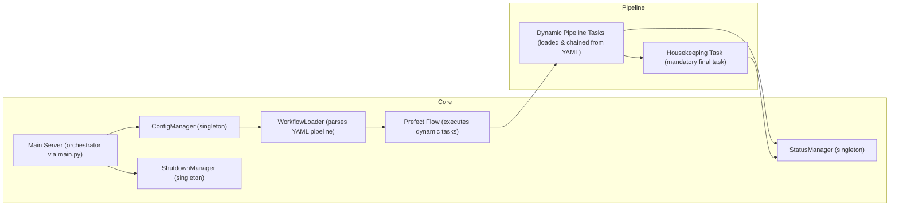

# Product Requirements Document: Redesigned PDF Document Processing System

## 1. Overview

This document outlines the product features for a redesigned PDF document processing system. The core idea is to move from a monolithic `ProcessingPipeline` to a **dynamic**, **YAML-driven** Prefect flow orchestrated by a comprehensive `main.py` application. This new architecture will allow for highly configurable and extensible workflows, supporting various input sources and output destinations.

-   **Dynamic Workflow Definition**: Workflows are defined directly within the main `config.yaml` file, allowing for flexible pipeline configurations without code changes.
-   **Dual Input Sources**: Supports ingestion from watch folders and web uploads, with future extensibility for other sources.
-   **Pluggable extraction plug**: Configurable data extraction from pdf document plug usually defined after ingestion.
-   **Pluggable Output Sinks**: Configurable output destinations including file system storage, CSV reference file updates, and archiving, with future support for external integrations like Baserow and n8n.
-   **Modular Task Design**: Each step in the pipeline after pdf document ingestionis a Prefect `@task`, loaded dynamically based on module path and parameters.
-   **Robust Error Handling**: Implements a "Railway Programming" approach to propagate errors and ensure graceful failure handling.
-   **Automated Housekeeping**: A fixed final task ensures cleanup and resource release regardless of pipeline success or failure.
-   **Singleton Managers**: Retains `ConfigManager` and `StatusManager` for centralized configuration and status tracking.

The goal is to provide a robust, flexible, and user-friendly system for processing PDF documents, suitable for both end users uploading documents and administrators managing the system.

---

## 2. Goals

- Enable dynamic pipeline configuration via YAML, allowing administrators to define and modify workflows without code changes.
- Support pluggable input sources, including watch folder monitoring and web interface uploads.
- Provide pluggable output sinks, including file system storage, CSV reference updates, archiving, and future integrations.
- Ensure robust error handling and graceful failure recovery using the Railway Programming pattern.
- Deliver a web interface with single-user authentication for secure, easy document uploads and status monitoring.
- Maintain centralized configuration and status management via singleton managers.
- Facilitate extensibility by supporting pluggable tasks loaded dynamically.
- Achieve high system reliability, user satisfaction, and ease of extensibility.

---

## 3. Target Users

- **End Users:** Individuals who upload PDF documents for processing. They interact primarily via:
  - The **watch folder** mechanism, where PDFs placed in a monitored directory are automatically processed.
  - The **web interface**, which allows manual PDF uploads and status monitoring.

- **Administrators:** Technical users responsible for:
  - Configuring and managing the processing pipeline via YAML configuration.
  - Monitoring system status and logs.
  - Managing authentication credentials and system settings.

---

## 4. User Stories

### End User Stories

1. As an end user, I want to upload PDF documents via a web interface so that I can process files without accessing the file system directly.
2. As an end user, I want to drop PDF files into a watch folder so that processing happens automatically without manual intervention.
3. As an end user, I want to view the processing status of my uploaded files so that I can track progress and errors.
4. As an end user, I want to view detailed file status information in a modal dialog without leaving the dashboard page so that I can see comprehensive processing details, timeline, and error information while maintaining context.

### Administrator Stories

4. As an administrator, I want to define and modify the processing pipeline dynamically using a YAML configuration file so that I can adapt workflows without changing code.
5. As an administrator, I want to manage user authentication credentials to secure access to the web interface.
6. As an administrator, I want to monitor detailed status and error logs for each processed file to troubleshoot issues effectively.
7. As an administrator, I want the system to support pluggable tasks so I can add custom processing steps without modifying the base code.

---

## 5. Functional Requirements

1. The system must allow users to upload PDF files via a web interface with validation of PDF headers.
2. The system must monitor a configured watch folder for new PDF files and process them automatically. The watch folder path is specified by the `watch_folder.dir` key in `config.yaml` and is validated at startup.
3.a The system must handle long file names and ensure compatibility with Windows path length limitations by using UUID-based renaming and Windows long path format handling.
3. The system must assign a unique UUID to each ingested file and track its processing status. The pdf document is also rename to this UUID.pdf text. The pdf document is place in a processing folder.
4. The system must provide a web interface with single-user authentication based on credentials defined in the configuration.
5. The system must expose API endpoints to:
    - Upload PDF files.
    - Retrieve a list of processed files with their statuses.
    - Retrieve detailed status for individual files, including complete processing history, timestamps in Singapore time (GMT+8), and comprehensive error information for modal dialog display.
6. The processing pipeline must be defined dynamically in a YAML configuration file (`config.yaml`), specifying task modules, parameters, and error handling policies. The pipeline is started after the system has assigned unique UUID and place the rename pdf docuemnt into a processing folder.
6.a The system must validate that **every** pipeline parameter whose key ends with `_dir` refers to an existing directory, and every pipeline parameter ending with `_file` refers to an existing file. On detection of any missing or inaccessible path, the application must log a critical error and exit before executing any pipeline tasks.
7. The pipeline must support pluggable tasks loaded dynamically by module path and parameters.
8. The pipeline must implement robust error handling using the Railway Programming pattern, propagating errors and allowing configurable continuation or stopping on errors.
11.a The system must provide detailed status management for each file, including granular updates at each processing step, timestamps, error messages, and support for status retrieval via API endpoints to facilitate monitoring and troubleshooting.
79. The system must implement retry logic for file operations such as copying or moving files, with configurable retry attempts and delay intervals to handle transient errors like file locks or network issues, including cleanup of temporary or partially moved files on failure.
80. The system must include a mandatory housekeeping task that runs after all other tasks to clean temporary files and update final status.
81. The web interface must implement secure single-user authentication using JWT tokens with configurable expiration times, secure password hashing, and session management to protect access to upload and monitoring features.
82. The system must update processing status granularly at each task step, including error messages and timestamps.
83. The system must support pluggable output sinks, including file system storage, CSV reference updates, and archiving.
84. The system must allow administrators to configure pipeline tasks and parameters without modifying base code.
85. The web interface must be easy to use, providing clear feedback on upload success, errors, and processing status.
86. The web interface must provide an in-page modal dialog for viewing detailed file status information without navigating away from the dashboard.
87. The system must enforce session expiration for web interface authentication tokens.
88. The system must validate uploaded files for PDF format before processing and reject invalid files immediately.

---

## 6. Non-Goals (Out of Scope)

- The system will not support multi-user authentication or role-based access control in the initial release.
- The system will not provide a graphical pipeline editor; pipeline configuration is YAML-based only.
- The system will not include advanced analytics or reporting features beyond status monitoring.
- The system will not support real-time collaborative editing of pipeline configurations.
- The system will not handle non-PDF document types in the current scope.

---

8.a The Railway Programming pattern allows the pipeline to continue executing subsequent tasks even if prior steps encounter errors, with error information logged for manual investigation and conditional task execution based on error presence.

## 7. Design Considerations

- The web interface should follow existing UI guidelines for simplicity and clarity.
- The pipeline configuration YAML should be well-documented with examples to facilitate administrator use.
- Status updates should be stored in JSON/TXT files alongside processed documents for easy retrieval.
- The system should use JWT tokens for session management with configurable expiration.
- Error messages should be user-friendly and provide actionable information where possible.
- The modal dialog interface should display comprehensive status information including processing timeline, error details, and reference document matches while maintaining dashboard context.
- The file status modal should support both CSS-based styling for optimal appearance and fallback inline styles for robustness.

-   **Graceful Shutdown Management**: Implement a centralized `ShutdownManager` singleton to coordinate graceful shutdown procedures, including registration and execution of cleanup callbacks, ensuring safe resource release and consistent application state during termination.

---

## 8. Technical Considerations

### 8.1. Core Components & Responsibilities



-   **ConfigManager**
    -   Loads the entire application configuration, including the pipeline definition, from `config.yaml`.
    -   Performs **static** directory validation for core storage, web, watch folder, and archive paths. The `watch_folder.dir` key is required and validated as a directory.
    -   Performs **dynamic** pipeline-path validation: for each step, any param ending in `_dir` or `_file` is checked for existence and proper access, with critical failure on any missing path.
    -   Provides a singleton instance, keyed by the configuration file path, for consistent access to configuration throughout the application.
    -   Exposes a `.get()` method for retrieving configuration values using dot notation.

-   **StatusManager**
    -   Manages the creation and updating of per-file status records (e.g., JSON/TXT files in a processing directory).
    -   Tracks the processing status, timestamps, and any error messages.
    -   **Enhanced Status Updates**: Each individual task will update the `StatusManager` with granular status messages (e.g., "Start extraction", "Extraction completed", "PO Matching in progress").
    -   **Status File Persistence**: Status files are stored in a unique UUID-based folder structure within the processing directory to avoid conflicts and improve organization.
    -   **Shared ConfigManager Usage**: The `StatusManager` must use the shared `ConfigManager` singleton instance rather than creating its own internally to avoid conflicts and ensure consistency.

-   **WorkflowLoader**
    -   Parses the `pipeline` section within `config.yaml` to construct the Prefect flow.
    -   Dynamically imports and instantiates tasks based on their module paths and parameters.
    -   Ensures tasks are chained correctly according to the YAML definition.

-   **Prefect Flow**
    -   The central orchestrator that executes the dynamically assembled tasks.
    -   Passes a shared `context: Dict` between tasks, which serves as the primary data transfer mechanism.
    -   **Enhanced Context Data**: The `context` dictionary will always include `{"data": ..., "error": None, "error_step": None}`. If an error occurs, `error` will contain the error message, and `error_step` will identify the task where the error originated.

-   **Tasks (Steps)**
    -   Individual, self-contained units of work within the pipeline.
    -   Each task receives the `context` dictionary as input and returns an updated `context` dictionary.
    -   **Standard Tasks**: Python modules for common operations (e.g., extraction, file system storage, archiving) will be organized under a `standard_step` folder.
    -   **Custom Tasks**: Python modules for specific customer requirements or integrations (e.g., Baserow storage, n8n triggers, unique backend integrations) will be organized under a `custom_step` folder.

-   **Housekeeping Task**
    -   A mandatory final task that executes regardless of the success or failure of preceding tasks.
    -   Responsible for cleaning up temporary files in the processing folder and releasing any held resources. Note: This task does not remove empty directories.
    -   Sends the final processing status (Completed or Error) to the `StatusManager`.

### 8.2. Standard Pipeline Tasks Details

#### 8.2.1. `standard_step.extraction.extract_pdf`
-   **Purpose:** Extracts structured data from PDF documents using the LlamaExtract service.
-   **Configuration:**
    -   Requires `api_key` and `agent_id` for the LlamaExtract service.
    -   Dynamically creates a Pydantic model based on `fields` defined in the `config.yaml` (e.g., `invoice_amount`, `invoice_no`, `supplier`).
    -   Supports `type` (e.g., `float`, `str`, `List[str]`) and `alias` for each field, allowing flexible mapping from LlamaExtract's output to desired field names.
-   **Configuration Source:** This task must obtain its configuration parameters from the centralized `ConfigManager` singleton at startup, which reads from `config.yaml`. It should not rely solely on parameters passed directly to the task.
-   **Data Extraction:**
    -   Takes a `pdf_path` as input.
    -   Uses the configured LlamaExtract agent to perform the extraction.
-   **Data Processing & Validation:**
    -   Handles raw extracted data, including potential `metadata`.
    -   Preprocesses data by filtering `None` values from lists if specified in the configuration (e.g., `List[str]`).
    -   Validates extracted data against the dynamically created Pydantic model, ensuring data integrity and type correctness.
    -   Logs validation errors.
-   **Output:** Returns a dictionary with `data` (extracted fields) and `metadata` (if present).
-   **Error Handling:** Includes robust error handling for file not found, invalid paths, LlamaExtract client initialization failures, and data validation errors.

#### 8.2.2. `standard_step.storage.store_metadata_as_csv`
-   **Purpose:** Stores extracted metadata into a CSV file.
-   **Configuration:**
-       `data_dir`: Specifies the directory where the CSV file will be saved.
-       `filename`: A string pattern (e.g., `"{supplier}_{invoice_amount}_{invoice_no}"`) used to name the CSV file. Values of field names from the extracted data will be used to populate the pattern.
-   **Configuration Source:** This task must obtain its configuration parameters from the centralized `ConfigManager` singleton at startup, which reads from `config.yaml`. It should not rely solely on parameters passed directly to the task.
-   **Data Handling:**
-       Takes extracted data (expected to be in the `{'data': {...}, 'metadata': {...}}` format).
-       Cleans string values in the extracted data by replacing newlines with spaces.
-       Processes data to create CSV columns using aliases and handles list values as comma-separated strings.
-       Uses the `alias` values from the `extraction.fields` configuration in `config.yaml` as column headers. It also handles list values by joining them into a comma-separated string.
-   **File Naming:** The csv filename will be from `filename` value. If there is existing file in the folder with the same filename, generate unique filenames by appending `_1`, `_2`, etc., to the base filename derived from the `filename` pattern, to prevent overwriting existing files.
-   **Error Handling:** Includes error handling for file writing operations.

#### 8.2.3. `standard_step.storage.store_metadata_as_json`
-   **Purpose:** Stores extracted metadata into a JSON file.
-   **Configuration:**
-       `data_dir`: Specifies the directory where the JSON file will be saved.
-       `filename`: A string pattern (e.g., `"{supplier}_{invoice_amount}_{invoice_no}"`) used to name the JSON file. Values of field names from the extracted data will be used to populate the pattern.
-   **Configuration Source:** This task must obtain its configuration parameters from the centralized `ConfigManager` singleton at startup, which reads from `config.yaml`. It should not rely solely on parameters passed directly to the task.
-   **Data Handling:**
-       Takes extracted data (expected to be in the `{'data': {...}, 'metadata': {...}}` format).
-       Transforms field names to alias and writes to JSON format.
-       Stores the data, transforming keys in the inner `data` dictionary from internal field names to their configured aliases.
-   **File Naming:** The json filename will be from `filename` value. If there is existing file in the folder with the same filename,generates unique filenames by appending `_1`, `_2`, etc., to the base filename derived from the `filename` pattern, to prevent overwriting existing files.
-   **Error Handling:** Includes error handling for file writing operations.

#### 8.2.4. `standard_step.storage.store_file_to_localdrive`
-   **Purpose:** Stores the processed PDF file to a local drive, with an option to rename it based on extracted data.
-   **Configuration:**
-       `files_dir`: Specifies the directory where the processed PDF files will be saved.
-       `filename`: A string pattern (e.g., `"{nanoid}_{supplier}_{invoice_amount}_{policy_number}"`) used to name the file. Values of field names from the extracted data that will be used to populate the `filename`.
-   **Configuration Source:** This task must obtain its configuration parameters from the centralized `ConfigManager` singleton at startup, which reads from `config.yaml`. It should not rely solely on parameters passed directly to the task.
-   **File Handling:**
-       Takes a `source_path` (the path to the PDF in the processing folder) and uses the `filename` pattern to generate the final filename.
-       Generates a unique filename with _1 or _2 in the filename in the `files_dir` to prevent overwriting if there is an existing filename that conflicts with the generated `filename` value.
-       Copies the file from the `source_path` to the `files_dir` using the unique filename.
-   **Error Handling:** Includes error handling for file storage operations.

#### 8.2.5. `standard_step.archiver.archive_pdf`
-   **Purpose:** Archives a copy of the processed PDF file (from the processing folder) to a specified archival folder. This ensures a backup copy is retained with its original filename for auditing or recovery purposes.
-   **Configuration:**
    -   `archive_dir`: Specifies the directory where the processed PDF files will be copied for archival.
    -   **Configuration Source:** This task must obtain its configuration parameters from the centralized `ConfigManager` singleton at startup, which reads from `config.yaml`. It should not rely solely on parameters passed directly to the task.
-   **File Handling:**
    -   Takes the `processed_file_path` (the path to the PDF in the processing folder, which has a unique UUID filename) as input.
    -   Copies the file from the `processed_file_path` to the `archive_dir`.
    -   The copied file in the `archive_dir` will be renamed to its `original_filename`.
-   **Error Handling:** Includes robust error handling for file copying operations, ensuring that the archival process is handled gracefully even in case of issues.

#### 8.2.6. `standard_step.context.assign_nanoid`
-   **Purpose:** Generates a unique nanoid identifier and adds it to the shared context for use in filename generation and data organization.
-   **Configuration:**
     -   `length`: Specifies the length of the generated nanoid (default: 10, range: 5-21 characters).
     -   **Configuration Source:** Obtains configuration parameters from the centralized `ConfigManager` singleton at startup.
-   **ID Generation:**
     -   Uses the Python nanoid library to generate secure, URL-friendly identifiers.
     -   Configurable length allows for customization based on organizational needs.
     -   Generates collision-resistant IDs suitable for use in filenames and database keys.
-   **Context Integration:**
     -   Adds the generated nanoid to the `context["data"]["nanoid"]` for downstream tasks.
     -   Enables dynamic filename generation in storage tasks (e.g., `{nanoid}_{supplier_name}_{invoice_amount}`).
-   **Error Handling:** Includes validation for length parameters and error handling for nanoid generation failures.
-   **Use Case:** Provides consistent, unique identifiers across the processing pipeline for tracking and organization purposes.

### 8.3. Task Inheritance Patterns

To facilitate reusable code structure and standardized error handling, we introduce a generic `BaseTask` abstract class with essential properties and methods:

#### Required Methods

- `on_start(self, context: dict)`
  - Initializes task environment and performs initial context validation.
- `execute(self, context: dict) -> dict`
  - Core business logic. Must implement this in subclasses.
  - Returns updated context after processing.
  - Raises `TaskError` exceptions if critical failures occur.
- `validate_required_fields(self, context: dict)`
  - Checks that all required configuration parameters are present.
  - Called automatically before `execute()`

#### Error Handling Patterns

- Base classes encapsulate error wrapping:
  ```python
  try:
      return self.execute(context)
  except TaskError as e:
      self.register_error(context, e)
      return  # Allows downstream error handling
  ```
- All errors inherit from `TaskError` base exception
- `register_error` method updates context with:
      'error_step': self.__class__.__name__
  })

### 8.4. Workflow Configuration & Execution

#### 8.4.1. `config.yaml` Structure
#
> **Note:**
> The application supports specifying the path to `config.yaml` at runtime (e.g., via command-line argument or environment variable). If not specified, it defaults to `config.yaml` in the project root.

The `config.yaml` file will now define the entire application configuration, including the pipeline flow.

```yaml

# Global application settings
web:
  host: "0.0.0.0"
  port: 8000
  secret_key: "your_secret_key"
  upload_dir: "web_upload" # Directory for web uploads

# Watch folder settings
watch_folder:
  dir: "watch_folder" # Directory for watch folder ingestion

authentication:
  username: "admin"
  password_hash: "$2b$12$..." # Hashed password

logging:
  log_file: "app.log"
  log_level: "INFO"
  log_format: "%(asctime)s %(levelname)s %(name)s %(message)s"

# Pipeline definition
tasks:
  extract_document_data:
    module: standard_step.extraction.extract_pdf
    class:  ExtractPdfTask
    params:
      api_key:        "your llamacloud key"
      agent_id:       "your lammaextract agent id not name"
      fields:
        supplier_name:
          alias: "Supplier name"
          type:  "str"
        client_name:
          alias: "Client name"
          type:  "str"
        client_address:
          alias: "Client"
          type:  "str"
        invoice_amount:
          alias: "Invoice amount"
          type:  "float"
        insurance_start_date:
          alias: "Insurance Start date"
          type:  "str"
        insurance_end_date:
          alias: "Insurance End date"
          type:  "str"
        policy_number:
          alias: "Policy Number"
          type:  "str"
        serial_numbers:
          alias: "Serial Numbers"
          type:  "Optional[Optional[List[str]]]"
        invoice_type:
          alias: "Invoice type"
          type:  "str"
    on_error: stop

  store_metadata_csv:
    module: standard_step.storage.store_metadata_as_csv
    class:  StoreMetadataAsCsv
    params:
      data_dir:  "test/data"
      filename:  "{nanoid}_{supplier_name}_{invoice_amount}_{policy_number}"
    on_error: continue

  store_metadata_json:
    module: standard_step.storage.store_metadata_as_json
    class:  StoreMetadataAsJson
    params:
      data_dir:  "test/data"
      filename:  "{nanoid}_{supplier_name}_{invoice_amount}_{policy_number}"
    on_error: continue

  store_file_to_localdrive:
    module: standard_step.storage.store_file_to_localdrive
    class:  StoreFileToLocaldrive
    params:
      files_dir: "test/files"
      filename:  "{nanoid}_{supplier_name}_{invoice_amount}_{policy_number}"
    on_error: continue

  archive_pdf:
    module: standard_step.archiver.archive_pdf
    class: ArchivePdfTask
    params:
      archive_dir: "test/archive_folder"
    on_error: continue

  housekeeping_task:
    module: standard_step.housekeeping.cleanup_task
    class: CleanupTask
    params: {}
    on_error: continue

  send_to_baserow:
    module: custom_step.integrations.baserow_upload
    class:  BaserowUploadTask
    params:
      api_key: "{{ secrets.BASEROW_API_KEY }}"
      table_id: "12345"
    on_error: continue

  trigger_n8n_webhook:
    module: custom_step.integrations.n8n_trigger
    class:  N8nTriggerTask
    params:
      webhook_url: "https://n8n.example.com/webhook/..."
      payload_fields: ["invoice_no", "total", "status"]
    on_error: continue

pipeline:
  - extract_document_data
  - assign_nanoid
  - store_metadata_csv
  - store_metadata_json
  - store_file_to_localdrive
  - archive_pdf

# The 'housekeeping_task' is explicitly included in the pipeline configuration
```

#### 8.4.2. Execution Flow

1.  **Input Ingestion**:
    *   **Watch Folder**: The watch folder is monitored continuously for new PDF files. Existing files in the configured directory are processed before starting the watcher. Each file undergoes:
        -   **Configuration**: Controlled by the `storage.input_dir` parameter in `config.yaml`
        -   **Validation**: Files are validated using a %PDF header check. Corrupted files are automatically deleted after 3 validation attempts
        -   **Processing**: Valid files are moved to the processing directory with UUID naming
    *   **Web Upload**: When a user uploads a PDF via the web interface:
        -   **Validation**: Files are validated using a %PDF header check. Invalid files rejected immediately
        -   **Processing**: Valid uploads are moved to the processing directory with UUID naming
2.  **Initial Status Management**:
    *   Upon ingestion (from both sources), the file is moved to a processing directory and assigned a UUID
    *   A status tracking file is generated with the following structure for both watch folder and web uploads:

        | Field              | Description                                                      |
        |--------------------|------------------------------------------------------------------|
        | original_filename  | The original name of the uploaded or ingested PDF file           |
        | source             | Source of the file ("web_upload" or "input_folder")              |
        | status             | Current processing status (see status table above)               |
        | timestamp_received | ISO timestamp when the file was first detected                   |
        | timestamp_updated  | ISO timestamp of the last status update                          |
        | error_message      | Error details if status is ERROR, otherwise null                 |
        | id                 | Unique identifier for the file (UUID, added by StatusManager for API listing)  |

3.  **Initial Status**: The `StatusManager` creates a new status record for the file, setting its status to "Pending".
4.  **Prefect Execution**: The Prefect flow begins executing tasks sequentially as defined in the `pipeline` section of `config.yaml`.
5.  **Context Passing**: Each task receives and returns the `context` dictionary, which carries data and status information between steps.
6.  **Granular Status Updates**: Each task updates the `StatusManager` with its current activity and completion status.
7.  **Error Handling**:
    *   If a task encounters an error, it updates the `context` with the error message and the `error_step`.
    *   The `on_error` policy in `config.yaml` determines the flow's behavior:
        *   `stop`: The pipeline immediately jumps to the `housekeeping` task.
        *   `continue`: The pipeline attempts to execute subsequent tasks, allowing for partial processing or recovery. Downstream tasks can check `context.get("error")` to decide whether to proceed.
8.  **Final Housekeeping**: After all defined tasks complete (or an `on_error: stop` condition is met), the `housekeeping` task is automatically executed.
    *   It cleans up any temporary files associated with the processing.
    *   It sends the final status (Completed or Error) to the `StatusManager`.

#### 8.4.3. Data Passing Between Tasks

**Context Dictionary Structure**:
- The `context` dictionary is shared across pipeline tasks, serving as the central data carrier. It evolves through each step with accumulated processing results and status metadata.

- The context is explicitly passed as input and output between Prefect tasks, ensuring each task receives the latest state and can modify it as needed.

- Tasks may add custom keys to the context dictionary to support extensibility, but should preserve core keys such as `data`, `error`, and `error_step`.

**Initial Context**:
- Populated at pipeline start with metadata:
```python
{
  "id": "<UUID>",
  "file_path": "original/file.pdf"
}
```

- After extraction, the context includes extracted data:
```json
{
  "id": "<UUID>",
  "file_path": "original/file.pdf",
  "data": {
    "invoice_id": "INV-2345",
    "amount": 25.99
  }
}
```

- After renaming task:
```json
{
  "id": "<UUID>",
  "file_path": "original/file.pdf",
  "data": {
    "invoice_id": "INV-2345",
    "amount": 25.99
  },
  "filename": "Acme_12345_20240101.pdf"
}
```

This detailed explanation clarifies how the context dictionary acts as the backbone of data flow in the dynamic pipeline, supporting robust error handling and extensibility.

### 8.4. Key Principles

-   **Railway Pattern**: Each task's output `context` explicitly includes `error` and `error_step` fields. Downstream tasks are responsible for checking these fields and deciding whether to proceed or gracefully skip their operations.
-   **Granular Status Reporting**: The `StatusManager` is updated by each task at key lifecycle points (start, completion, failure) to provide real-time visibility into the pipeline's progress.
-   **Mandatory Housekeeping**: The `housekeeping` task is guaranteed to run, ensuring that temporary files are cleaned up and final status is recorded, regardless of the outcome of the processing steps.

These patterns ensure robust, consistent configuration management and dynamic task loading, providing a flexible and reliable foundation for the PDF processing system.

### 8.5. Status Update System

The system implements a granular status update system to provide real-time visibility into pipeline progress. Key features include:

#### 8.5.1. StatusManager Overview
-   **Singleton Design**: Utilizes a singleton pattern for thread-safe status management across the application.
-   **File-based Storage**: Stores status information in JSON/TXT files within the processing directory for easy retrieval and persistence.
-   **Thread-safe Operations**: All status file I/O operations are protected by instance-level locks to prevent race conditions.

#### 8.5.2. Status File Structure
Each processing file has a dedicated status file (named `<UUID>.txt`) containing:
```json
{
  "id": "unique-uuid",
  "original_filename": "invoice_123.pdf",
  "source": "watch_folder",  // or "web_upload"
  "file": "uuid-filename.pdf",
  "status": "Pending|Processing|Completed|Error",
  "timestamps": {
    "created": "2025-01-01T10:00:00Z",
    "pending": "2025-01-01T10:00:00Z",
    "extraction_started": "2025-01-01T10:01:00Z",
    "extraction_completed": "2025-01-01T10:02:00Z",
    "Task Completed: assign_nanoid": "2025-01-01T10:02:15Z"
  },
  "error": null,
  "details": {}
}
```

#### 8.5.3. Granular Status Updates
-   **Task Lifecycle Updates**: Each task updates the StatusManager at start, completion, and failure points.
-   **Step-specific Timestamps**: Individual pipeline steps record their own timestamps (e.g., "Task Started: extract_pdf", "Task Completed: assign_nanoid").
-   **Error Tracking**: Failed tasks include error details and the specific step where the error occurred.
-   **Real-time Monitoring**: Status can be retrieved via API endpoints to support monitoring dashboards.

#### 8.5.4. Status Cleanup
-   **Automatic Cleanup**: The StatusManager provides cleanup functionality to remove status files for completed or failed processes.
-   **Persistence**: Completed/failed status files can optionally be retained for audit purposes.
-   **Performance**: Cleanup prevents accumulation of outdated status files.

This comprehensive status system ensures administrators and users can monitor pipeline progress in real-time, troubleshoot issues effectively, and maintain audit trails of all processing activities.

### 8.6. Web Interface Features

The web interface serves as a user-friendly control panel for monitoring and managing the PDF processing pipeline. Key features include:

#### 8.5.1. User Authentication
-   **Single-user authentication**: Users can log in using credentials specified in the configuration. The system uses JWT (JSON Web Tokens) for session management.
    -   **Config Setting**: The username and hashed password are set in the `authentication` section of the `config.yaml` file.

#### 8.5.2. File Management
-   **PDF Upload**: Users can upload PDF files via the web interface. The system checks for valid PDF headers and moves the files to the appropriate processing directory.
    -   **API Route**: `POST /upload`: Handles file upload and initiates pipeline processing.
    -   **Storage Location**: The default upload location is defined in the `web.upload_dir` configuration parameter.

#### 8.5.3. Status Monitoring
-   Users can monitor the status of both current and past PDF processing operations:
    -   **API Route**: `GET /api/files`: Retrieves a list of all processing and recently processed files, including their status and error messages.
    -   **API Route**: `GET /api/status/{file_id}`: Retrieves detailed status information for a specific file.

#### 8.5.4. Session Expiry and Security
-   Access tokens are set to expire after a specified duration (default 30 minutes) to ensure security.
    -   **Config Setting**: `ACCESS_TOKEN_EXPIRE_MINUTES` can be adjusted in the application configuration.

#### 8.5.5. Error Handling
-   The web interface gracefully handles errors, redirecting users to the login page if authentication fails or session expires. It provides clear feedback on file upload issues and other exceptions.

These features make the web interface a powerful tool for day-to-day operation of the document processing pipeline, complementing the automated capabilities of the watch folder monitoring system.

#### 8.5.6. Enhanced File Status Modal Dialog

The web interface includes an advanced modal dialog system for comprehensive file status viewing:

**Modal Dialog Features**:
- **In-Page Status Display**: File status details shown in overlay modal without navigation
- **Comprehensive Information**: Displays complete status data including timestamps, errors, and processing history
- **Processing Timeline**: Visual chronological display of all processing steps with Singapore time (GMT+8)
- **Reference Document Matching**: Special notifications when processed documents match reference files
- **Collapsible Debug View**: Technical users can view raw JSON status data for troubleshooting
- **Accessibility Support**: Proper focus management, keyboard navigation, and screen reader compatibility
- **Robust Fallback System**: Inline CSS styles ensure functionality even if external stylesheets fail to load

**Technical Implementation**:
- **Enhanced API Endpoint**: `/api/status/{file_id}` returns complete status data with timestamps and details
- **Smart State Detection**: Automatically handles files still in processing vs. completed files
- **Responsive Grid Layout**: Status fields automatically adapt to different screen sizes
- **Color-Coded Timeline**: Visual indicators for different processing states (pending, completed, error)
- **Graceful Error Handling**: User-friendly error messages for API failures and missing data

**User Experience Benefits**:
- **Context Preservation**: Users remain on dashboard while viewing detailed status
- **Enhanced Monitoring**: Rich status information supports better troubleshooting
- **Time Zone Awareness**: All timestamps displayed in local Singapore time
- **Progressive Enhancement**: Works with CSS styling or falls back to inline styles
- **Non-Blocking Operation**: Background polling continues while modal is open

### 8.7. Modal Dialog Implementation Details

#### 8.7.1. Enhanced Status API
- **Complete Data Response**: `/api/status/{file_id}` endpoint enhanced to return full status information including timestamps, details, and processing history
- **Singapore Timezone Support**: All timestamps automatically converted to GMT+8 for user-friendly display
- **Graceful Fallback Handling**: Returns placeholder status objects for files still in processing instead of 404 errors
- **Thread-Safe Operations**: Fixed dictionary iteration issues to prevent RuntimeError during concurrent access

#### 8.7.2. Frontend Modal Architecture
- **Responsive Grid Layout**: Status information displayed in CSS Grid with automatic column adaptation
- **Timeline Visualization**: Chronological processing steps with color-coded status indicators
- **Reference Document Detection**: Special notifications when processed files match reference documents
- **Debug Capability**: Collapsible raw JSON view for technical troubleshooting
- **Accessibility Features**: Focus management, keyboard navigation, and screen reader support
- **Robust Styling**: Dual CSS + inline style system ensures functionality regardless of stylesheet loading

#### 8.7.3. User Experience Enhancements
- **Context Preservation**: Modal overlay maintains dashboard visibility and polling functionality
- **Smart Error Handling**: Differentiates between actual errors and files still processing
- **Progressive Enhancement**: Works with optimal CSS styling or falls back to functional inline styles
- **Empty State Design**: Improved "no files found" messaging with helpful guidance

### 8.8. Future Enhancements

The current implementation provides a robust foundation for PDF document processing. Future enhancements may include:

#### 8.7.1. External Integrations
-   **Baserow Integration**: Custom step for storing extracted data in Baserow databases will be implemented as a `custom_step.integrations.baserow_upload` module.
-   **n8n Integration**: Workflow automation triggers via n8n webhook will be available as `custom_step.integrations.n8n_trigger` module.
-   **Additional Integrations**: Support for other external systems like Google Sheets, Microsoft Teams, or custom REST APIs.

#### 8.7.2. Advanced Features
-   **Multi-user Authentication**: Support for multiple user accounts with role-based access control.
-   **Advanced Analytics**: Detailed processing metrics, performance monitoring, and reporting dashboards.
-   **Real-time Notifications**: Email or webhook notifications for processing failures and completions.
-   **Bulk Processing**: Support for processing multiple files in batches with progress tracking.

These enhancements will be implemented in future releases based on user feedback and requirements.

---
## 9. Event-Driven Workflow Execution Integration (Addendum)

### 9.1 Overview
To ensure both watch folder and web upload sources trigger the dynamic Prefect workflow in a unified, event-driven manner, the system must centralize file ingestion, status creation, and workflow triggering logic.

### 9.2 Unified Ingestion and Triggering Process
- **Step 1:** File is received from either the watch folder or web upload.
- **Step 2:** The file is validated, moved to the processing folder, assigned a UUID, and a status record is created.
- **Step 3:** The ingestion logic (now unified) calls `WorkflowManager.trigger_workflow_for_file()` with the file path, UUID, original filename, and source ("watch_folder" or "web_upload").
- **Step 4:** WorkflowManager loads and starts the Prefect flow with the correct context.
- **Step 5:** StatusManager records workflow initiation and any errors.

### 9.3 Example Context Dictionary
```python
{
  "id": "<UUID>",
  "file_path": "processing_folder/<UUID>.pdf",
  "original_filename": "invoice_123.pdf",
  "source": "watch_folder"  # or "web_upload"
}
```

### 9.4 Implementation Guidance
- Refactor file ingestion logic so both watch folder and web upload use the same function to move files, create status, and trigger workflows.
- The workflow triggering function must be source-agnostic and accept a `source` parameter.
- Update all relevant handlers (watch folder callback, web upload endpoint) to use this unified ingestion function.

### 9.5 Benefits
- Ensures all files, regardless of ingestion source, are processed identically.
- Reduces code duplication and risk of inconsistent behavior.
- Simplifies future extension to new ingestion sources.

<!-- End of Addendum -->
---

## 9. Success Metrics

- **System Reliability:** Achieve 99.9% uptime for the processing pipeline and web interface.
- **User Satisfaction:** Positive feedback from end users on ease of uploading and monitoring documents via the web interface.
- **Extensibility:** Ability to add new pipeline tasks and integrations without modifying base code.
- **Error Handling:** Reduction in failed processing runs due to improved error propagation and handling.
- **Pipeline Configuration:** Administrators can update pipeline workflows dynamically via YAML without requiring developer intervention.
- **Processing Throughput:** Efficient processing of PDF documents with minimal delay from ingestion to completion.
- **Security:** Secure single-user authentication with session expiration and protection against unauthorized access.

---

## 9.5 v2 Experimental Pipeline: LlamaExtract Array-of-Objects Support

### 9.5.1 Overview
The v2 experimental pipeline extends the system to handle LlamaExtract responses containing arrays of objects (e.g., invoice line items). This feature allows extraction of structured data where certain fields return lists of sub-objects, such as Items: [{Description, Quantity}, ...]. The v2 pipeline is implemented as parallel modules to the existing v1 pipeline, using a separate dev_config.yaml for safe testing without impacting production.

### 9.5.2 Goals
- Enable extraction of array-of-objects from LlamaExtract responses without breaking existing scalar field extraction.
- Normalize extracted line items into a consistent List[Any] structure under context["data"]["items"].
- Provide flexible storage options: JSON preserving the list structure, and CSV with options for row-per-item or single-row with JSON column.
- Maintain full backward compatibility with v1 pipeline; v2 is opt-in via configuration.

### 9.5.3 Schema Handling
- **Discovery**: The extraction configuration (extraction.fields) marks fields as tables using `is_table: true` - uses the normalized field name as the context key.
- **Normalization**: Array-of-objects are flattened into List[Any] with cleaned string values.
- **Example LlamaExtract Response**:
  ```json
  {
    "data": {
      "Supplier name": "ALLIGATOR SINGAPORE PTE LTD",
      "Items": [
        {"Description": "ELECTRODE G-300 3.2MM 5KG", "Quantity": "4.0 PKT"},
        {"Description": "QUICK COUPLER SOCKET", "Quantity": "2.0 PCS"}
      ]
    }
  }
  ```
- **Normalized Context**:
  ```python
  {
    "data": {
      "supplier_name": "ALLIGATOR SINGAPORE PTE LTD",
      "items": [  # normalized field name from LlamaCloud schema
        {"description": "ELECTRODE G-300 3.2MM 5KG", "quantity": "4.0 PKT"},
        {"description": "QUICK COUPLER SOCKET", "quantity": "2.0 PCS"}
      ]
    }
  }
  ```

### 9.5.4 Storage Semantics
- **JSON Storage (v2)**: Preserves the list-of-dicts under the normalized field name (e.g., 'items'), with top-level fields mapped to aliases.
- **CSV Storage (v2)**:
  - **Row-per-item mode**: Emits N rows for N line items, repeating scalar fields in each row. Array fields marked with `is_table: true` have their contents expanded into separate columns (prefixed with 'item_').
  - **Field Classification**: Scalar (non-array) fields are repeated in each CSV row. Array fields marked with `is_table: true` are treated as containing multiple items to be expanded.
  - **Column Naming**: Item-level columns use the alias as-is (e.g., 'description' becomes 'item_description').
- **Example CSV (Row-per-item)**:
  ```
  supplier_name,invoice_amount,item_description,item_quantity  # item_ prefix + alias as-is
  ALLIGATOR SINGAPORE PTE LTD,44.62,ELECTRODE G-300 3.2MM 5KG,4.0 PKT
  ALLIGATOR SINGAPORE PTE LTD,44.62,QUICK COUPLER SOCKET,2.0 PCS
  ```

### 9.5.5 Configuration Example
Add to extraction.fields in dev_config.yaml:
```yaml
items:  # Field name from LlamaCloud schema (normalized)
  alias: "Items"  # Matches LlamaCloud response
  type: "List[Any]"  # Currently supported type (may require extending parser for Dict)
  is_table: true  # Marks this field as an array of objects
  item_fields:  # Optional: mapping for sub-fields within each item
    Description:
      alias: "description"  # Used as-is in context and as CSV column name
      type: "str"
    Quantity:
      alias: "quantity"     # Used as-is in context and as CSV column name
      type: "str"
```

### 9.5.6 Implementation Notes
- v2 modules are created as new files (e.g., extract_pdf_v2.py) inheriting from BaseTask.
- All new tests use mocking to avoid external API calls.
- Dev config uses test directories to prevent production impact.
- Migration to production requires updating config.yaml with v2 module paths and field annotations.
- **Type Parser Extension**: May require extending the dynamic model factory to support Dict in addition to current supported types (List, Optional, primitives, Any).

### 9.5.7 Current Limitations
**Single Table Support**: Only one `is_table: true` field is supported per extraction. Multiple array fields (e.g., items, taxes, fees) cannot be flattened simultaneously - the CSV writer would produce ambiguous or colliding columns.

**Flat Structure Assumption**: Items must be simple dictionaries. Nested arrays or objects within items (e.g., `items[*].lots[*]`) require multi-level expansion logic not currently implemented.

**Linear Column Naming**: The `item_{alias}` naming scheme works for single tables but may create collisions or unclear semantics with multiple hierarchical tables. A more expressive naming convention would be needed for complex schemas.

**JSON Pass-through**: Storage preserves the list-of-dicts structure without validation, flattening, or size management. Large or deeply nested structures may create unwieldy payloads without proper handling.

**Type System Constraints**: Relies on the existing eval-based type parser. Extending to handle complex nested types safely would require significant changes to avoid eval security risks and parsing complexity.

---

## 10. Open Questions

- Should the system support multiple user roles or multi-user authentication in future releases?
- Are there any specific UI/UX design guidelines or mockups for the web interface beyond the existing user guide?
- What is the expected maximum file size or volume of PDF documents to be processed concurrently?
- Are there any preferred external integrations or custom tasks to prioritize beyond Baserow and n8n?
- Should the system provide notifications or alerts on processing failures or critical errors?
